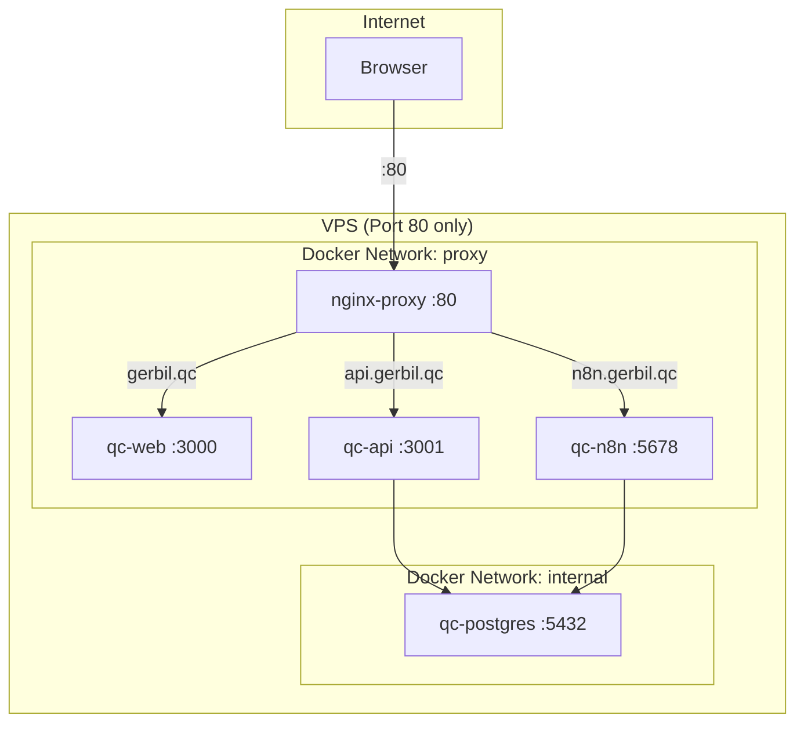

# AGENTS.md
This file provides guidance to Verdent when working with code in this repository.

## Table of Contents
1. Commonly Used Commands
2. High-Level Architecture & Structure
3. Key Rules & Constraints
4. Development Hints

## Commands
- **Create proxy network (one-time):** `docker network create proxy`
- **Start reverse proxy:** `cd reverse-proxy && docker compose up -d`
- **Start all services (dev):** `docker compose up -d`
- **Start production:** `docker compose -f docker-compose.prod.yml up -d`
- **API dev (local):** `cd apps/api && npm install && npm run dev`
- **Web dev (local):** `cd apps/web && npm install && npm run dev`
- **Build web:** `cd apps/web && npm run build`
- **Database only:** `docker compose up -d postgres`
- **View logs:** `docker compose logs -f <service>` (services: qc-postgres, qc-api, qc-web, qc-n8n)
- **Reload nginx proxy:** `docker exec nginx-proxy nginx -s reload`
- **No lint/test commands configured** [inferred]

## Architecture

### Subsystems
- **reverse-proxy/** - Central Nginx reverse proxy for subdomain routing
  - Routes subdomains to containers via `proxy` Docker network
  - Config files in `nginx/conf.d/*.conf`
- **apps/api/** - Express.js REST API (Node.js 18, port 3001)
  - Routes: projects, tasks, resources, test-cases, test-executions, test-results, dashboard, reports, governance
  - Validation: Zod schemas in `src/schemas/`
  - Middleware: error handling, audit logging
  - n8n integration via `src/utils/n8n.js`
- **apps/web/** - Next.js 14 frontend (React 18, TypeScript, Tailwind CSS, port 3000)
  - App Router pages in `app/`
  - Reusable components in `src/components/`
  - API client in `src/lib/`
- **database/** - PostgreSQL 15 schema and migrations
  - Base schema: `schema.sql`
  - Migrations numbered 001-007 in `migrations/`
- **n8n/** - Workflow automation (report generation, cleanup)

### Docker Networking

### Container Names
| Service    | Container      | Internal Port | Subdomain        |
|------------|----------------|---------------|------------------|
| Web        | qc-web         | 3000          | gerbil.qc        |
| API        | qc-api         | 3001          | api.gerbil.qc    |
| n8n        | qc-n8n         | 5678          | n8n.gerbil.qc    |
| PostgreSQL | qc-postgres    | 5432          | (internal only)  |

### Key Database Tables
- `projects`, `tasks`, `resources`, `audit_log`
- `test_cases`, `test_executions`, `test_results`
- `quality_gates`, `release_approvals`
- Database views for real-time dashboard metrics
(Note: table names use plural form in API queries)

### External Dependencies
- PostgreSQL 15 (required)
- n8n 1.29.0 (async reports, workflows - optional for basic usage)
- Docker Hub (CI/CD image registry)
- Hostinger VPS (production deployment target)

## Key Rules & Constraints
- **Docker network**: All services connect via external `proxy` network; create with `docker network create proxy`
- **No port exposure**: Production containers do not expose ports directly; all traffic routes through nginx-proxy
- **Soft delete pattern**: Projects/tasks use `deleted_at` timestamp, not hard deletes
- **Task status flow**: pending → in_progress → completed/failed/blocked (validated in API)
- **Project status**: active, completed, on_hold, cancelled, deleted
- **Environment variables**: Copy `.env.example` to `.env`; `JWT_SECRET` and `N8N_BASIC_AUTH_PASSWORD` are required
- **API URL**: Frontend uses `NEXT_PUBLIC_API_URL` env var (build-time baked for production: `http://api.gerbil.qc`)
- **CI/CD**: Push to `main` triggers automatic build and deploy to VPS via GitHub Actions

## Development Hints

### Adding a New API Endpoint
1. Create route file in `apps/api/src/routes/`
2. Add Zod schema in `apps/api/src/schemas/` if needed
3. Register route in `apps/api/src/index.js`: `app.use('/path', require('./routes/file'))`
4. Use `pool.query()` from `src/config/db.js` for database access

### Adding a New Frontend Page
1. Create page in `apps/web/app/<route>/page.tsx` (App Router convention)
2. Use existing components from `src/components/ui/` and `src/components/<domain>/`
3. Add types to `src/types/`
4. Use `src/lib/api.ts` for API calls [inferred]

### Adding a New Subdomain/App
1. Create nginx config in `reverse-proxy/nginx/conf.d/<app>.conf`
2. Add service to docker-compose with:
   - `container_name: qc-<name>`
   - `networks: [proxy]` (and `internal` if DB access needed)
   - No `ports:` exposure
3. Reload proxy: `docker exec nginx-proxy nginx -s reload`

### Database Migrations
1. Modify `apps/api/src/config/db.js` `runMigrations()` function.
2. Migrations run automatically on API container startup.
3. (Legacy) SQL files in `database/migrations/` are for reference only.

### Modifying CI/CD
- Workflow: `.github/workflows/deploy.yml`
- Secrets needed: `DOCKER_HUB_USERNAME`, `DOCKER_HUB_TOKEN`, `VPS_HOST`, `VPS_USERNAME`, `VPS_SSH_KEY`, `SSH_PASSPHRASE`, `JWT_SECRET`, `POSTGRES_PASSWORD`, `N8N_BASIC_AUTH_PASSWORD`, `NEXT_PUBLIC_API_URL`
- Production compose: `docker-compose.prod.yml` (uses pre-built images from Docker Hub)
- Reverse proxy: `reverse-proxy/docker-compose.yml` (started automatically by CI/CD)

### n8n Workflows
- JSON definitions in `n8n/` directory
- Import via n8n UI at http://n8n.gerbil.qc
- Triggered by API via webhook calls to `http://qc-n8n:5678/webhook` (internal)
