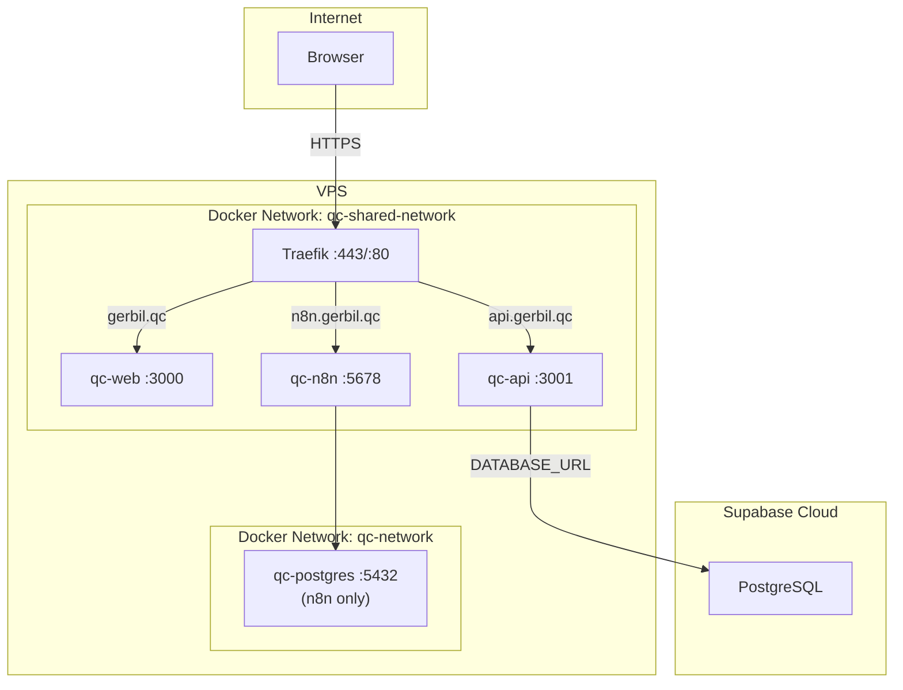

# AGENTS.md
This file provides guidance when working with code in this repository.

## Table of Contents
1. Commonly Used Commands
2. High-Level Architecture & Structure
3. Key Rules & Constraints
4. Development Hints

## Commands
- **Create shared network (one-time):** `docker network create qc-shared-network`
- **Start all services (dev):** `docker compose up -d`
- **Start production:** `docker compose -f docker-compose.prod.yml up -d`
- **API dev (local):** `cd apps/api && npm install && npm run dev`
- **Web dev (local):** `cd apps/web && npm install && npm run dev`
- **Build web:** `cd apps/web && npm run build`
- **Run API tests:** `cd apps/api && npm test`
- **View logs:** `docker compose logs -f <service>` (services: qc-api, qc-web)
- **No lint commands configured** [inferred]
- **Deploy to production (when user says "deploy"):**
  1. Stage changed files: `git add <files>`
  2. Commit: `git commit -m "<descriptive message>"`
  3. Push: `git push`
  4. CI/CD pipeline auto-builds and deploys to VPS via GitHub Actions

## Architecture

### Subsystems
- **apps/api/** - Express.js REST API (Node.js 18, port 3001)
  - Routes: auth, projects, tasks, resources, test-cases, test-executions, test-results, dashboard, reports, governance, users, teams, roles, bugs, journeys, myJourneys, managerView, personalTasks, notifications, tuleapWebhook
  - Validation: Zod schemas in `src/schemas/`
  - Middleware: error handling, audit logging
  - n8n integration via `src/utils/n8n.js`
  - Database: Supabase (cloud PostgreSQL) via `src/config/db.js`
- **apps/web/** - Next.js 14 frontend (React 18, TypeScript, Tailwind CSS, port 3000)
  - App Router pages in `app/` (18 routes)
  - Reusable components in `src/components/`
  - API client in `src/lib/`
- **database/migrations/** - Reference SQL migration files (migrations run via `db.js` on API startup)
- **n8n/** - Workflow automation (report generation, cleanup)

### Docker Networking

```mermaid
flowchart TB
    subgraph Internet
        Browser
    end
    subgraph VPS["VPS"]
        subgraph shared_net["Docker Network: qc-shared-network"]
            traefik["Traefik :443/:80"]
            web["qc-web :3000"]
            api["qc-api :3001"]
            n8n["qc-n8n :5678"]
        end
        subgraph internal_net["Docker Network: qc-network"]
            pg["qc-postgres :5432<br/>(n8n only)"]
        end
    end
    subgraph Cloud["Supabase Cloud"]
        supabase_db["PostgreSQL"]
    end
    Browser -->|HTTPS| traefik
    traefik -->|gerbil.qc| web
    traefik -->|api.gerbil.qc| api
    traefik -->|n8n.gerbil.qc| n8n
    api -->|DATABASE_URL| supabase_db
    n8n --> pg
```

### Container Names
| Service    | Container      | Internal Port | Subdomain        |
|------------|----------------|---------------|------------------|
| Web        | qc-web         | 3000          | gerbil.qc        |
| API        | qc-api         | 3001          | api.gerbil.qc    |
| n8n        | qc-n8n         | 5678          | n8n.gerbil.qc    |
| PostgreSQL | qc-postgres    | 5432          | (n8n internal only) |

### Key Database Tables
- `projects`, `tasks`, `resources`, `audit_log`
- `test_cases`, `test_run`, `test_execution`, `test_executions`, `test_results`
- `quality_gates`, `release_approvals`, `report_jobs`
- `app_user`, `teams`, `personal_tasks`, `task_comments`
- `bugs`, `tuleap_sync_config`, `tuleap_webhook_log`, `tuleap_task_history`
- `notifications`
- Database views: `v_dashboard_metrics`, `v_projects_with_metrics`, `v_resources_with_utilization`, `v_tasks_with_metrics`, `v_bug_summary`, `v_bug_summary_global`
(Note: table names use plural form in API queries)

### External Dependencies
- Supabase (cloud PostgreSQL — required for app data)
- PostgreSQL 15 local (n8n only — optional if n8n not used)
- n8n 1.29.0 (async reports, workflows — optional for basic usage)
- Docker Hub (CI/CD image registry)
- Traefik (production reverse proxy with auto TLS)

## Key Rules & Constraints
- **Docker network**: All services connect via external `qc-shared-network`; create with `docker network create qc-shared-network`
- **No port exposure**: Production containers do not expose ports directly; all traffic routes through Traefik
- **Supabase**: API connects to Supabase cloud via `DATABASE_URL` / `SUPABASE_DATABASE_URL` env var
- **Soft delete pattern**: Projects/tasks use `deleted_at` timestamp, not hard deletes
- **Task status flow**: Backlog → In Progress → Done/Cancelled (validated in API)
- **Project status**: active, completed, on_hold, cancelled, deleted
- **Environment variables**: Copy `.env.example` to `.env`; `JWT_SECRET`, `DATABASE_URL`, and Supabase keys are required
- **API URL**: Frontend uses `NEXT_PUBLIC_API_URL` env var (build-time baked for production)
- **CI/CD**: Push to `main` triggers automatic build and deploy to VPS via GitHub Actions
- **Auth**: JWT-based with roles: admin, manager, user, viewer, contributor

## Development Hints

### Adding a New API Endpoint
1. Create route file in `apps/api/src/routes/`
2. Add Zod schema in `apps/api/src/schemas/` if needed
3. Register route in `apps/api/src/index.js`: `app.use('/path', require('./routes/file'))`
4. Use `pool.query()` from `src/config/db.js` for database access (connects to Supabase)

### Adding a New Frontend Page
1. Create page in `apps/web/app/<route>/page.tsx` (App Router convention)
2. Use existing components from `src/components/ui/` and `src/components/<domain>/`
3. Add types to `src/types/`
4. Use `src/lib/api.ts` for API calls [inferred]

### Database Migrations
1. Modify `apps/api/src/config/db.js` `runMigrations()` function.
2. Migrations run automatically on API startup (creates tables/columns if not exist).
3. SQL files in `database/migrations/` are for reference only.

### Modifying CI/CD
- Workflow: `.github/workflows/deploy.yml`
- Secrets needed: `DOCKER_HUB_USERNAME`, `DOCKER_HUB_TOKEN`, `VPS_HOST`, `VPS_USERNAME`, `VPS_SSH_KEY`, `SSH_PASSPHRASE`, `JWT_SECRET`, `SUPABASE_DATABASE_URL`, `NEXT_PUBLIC_API_URL`
- Production compose: `docker-compose.prod.yml` (uses pre-built images from Docker Hub)

### n8n Workflows
- JSON definitions in `n8n/` directory
- Import via n8n UI at http://n8n.gerbil.qc
- Triggered by API via webhook calls to `http://qc-n8n:5678/webhook` (internal)
