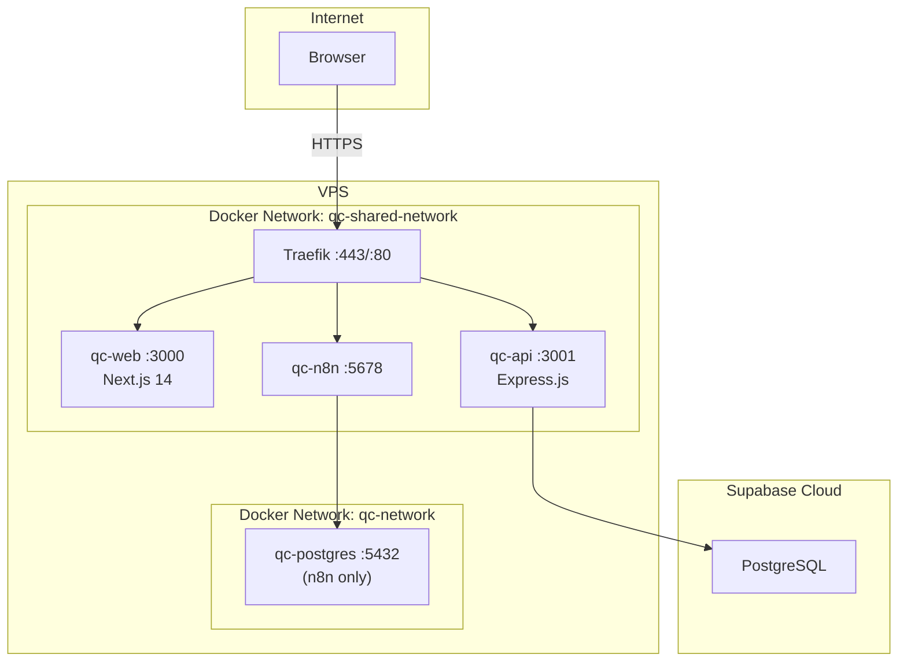

# QC-Manager

**Quality Control and Delivery Management Platform**

QC-Manager is a quality-operations and governance platform that mirrors Tuleap artifacts into a QC-owned database and adds test management, dashboards, resource planning, access control, notifications, and reporting on top.

## What Problem Does It Solve?

QA Leads manage release readiness across fragmented spreadsheets, ticketing systems, and manual reports. QC-Manager provides a single source of truth for quality status, standardized governance, and traceable release decisions — with minimal manual effort.

## Who Uses It?

| Role | Responsibility |
|------|----------------|
| Admin | System configuration, user management, RBAC |
| PM | Project oversight, dashboards, governance |
| Team Manager | Resource management, IDPs, team dashboards |
| Tester | Test execution, bug reporting, personal tasks |
| Viewer | Read-only access to dashboards and reports |
| Contributor | Limited data entry and view access |

## Main Capabilities

- **Work Tracking**: Projects, user stories, tasks, bugs, task assignments, soft deletes
- **Test Management**: Test cases, suites, runs, executions, result upload, quality metrics
- **Dashboards**: Global, PM, team-manager, and member role-specific dashboards
- **Governance**: Quality gates, release approvals, release readiness, trend views, quality reports
- **People Management**: Users, teams, resources, journeys, onboarding/probation, IDPs
- **Access Control**: Shared RBAC catalog, role permissions, per-user overrides, scoped access
- **Integrations**: Tuleap bidirectional artifact sync, n8n workflows, Supabase auth/storage, TestSprite
- **Notifications**: In-app notifications, preferences, profile data, landing page customization

## High-Level Architecture



## Quick Start

```bash
docker network create qc-shared-network
cp .env.example .env
docker compose up -d
```

- **Web**: http://localhost:3000
- **API**: http://localhost:3001

For detailed setup, see the [Local Setup Guide](docs/operations/local-setup.md).

## Technology Stack

| Layer | Technology |
|-------|------------|
| Frontend | Next.js 14, React 18, TypeScript, Tailwind CSS, Radix UI |
| Backend | Node.js 18, Express 4, Zod, JWT, pg |
| Database | PostgreSQL (Supabase cloud for production) |
| Auth | Supabase Auth + JWT fallback |
| Automation | n8n workflow engine |
| Testing | Jest/Supertest (API), Playwright (E2E) |

## Full Documentation

→ [Documentation Index](DOCUMENTATION_INDEX.md)

See also: [Domain Language](docs/technical/domain-language.md), [ADR Index](docs/internal/adr/README.md), [License](LICENSE)
