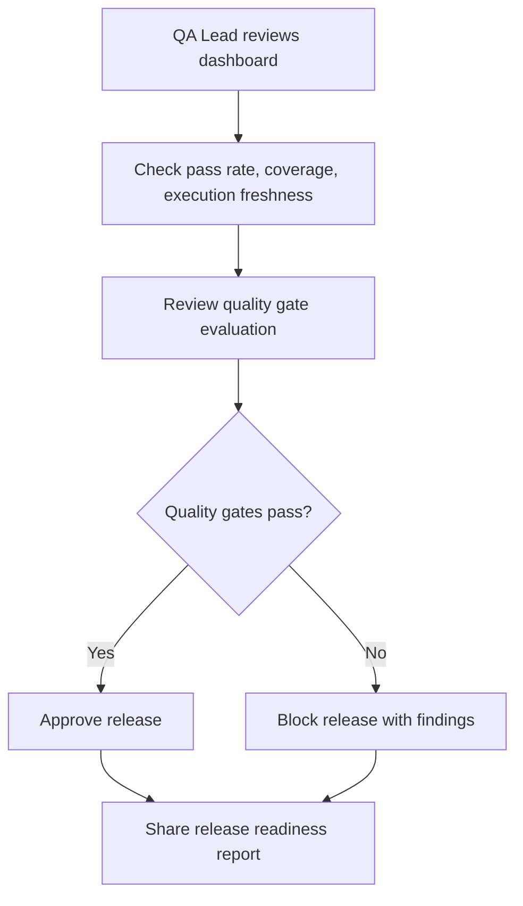
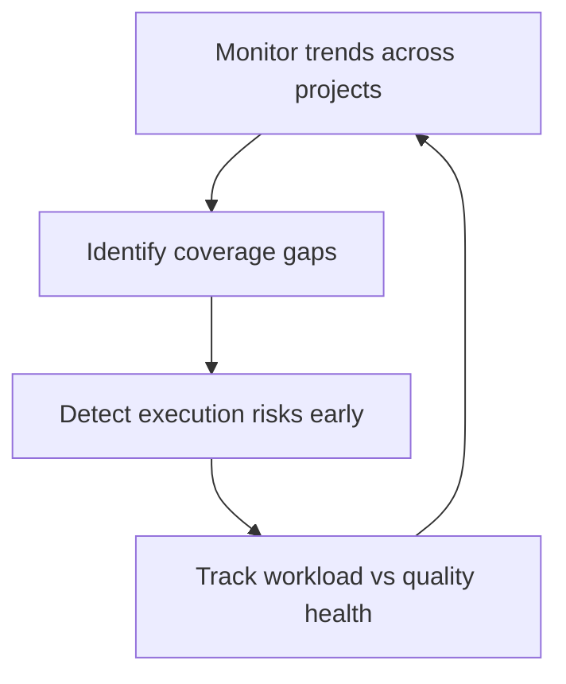
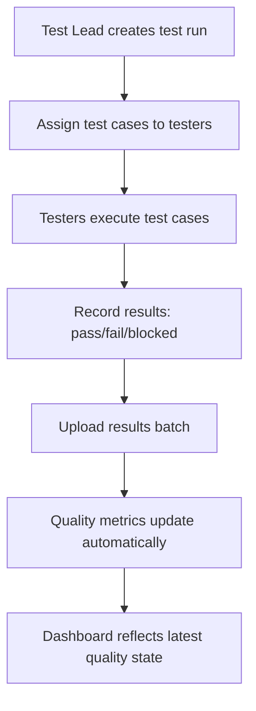
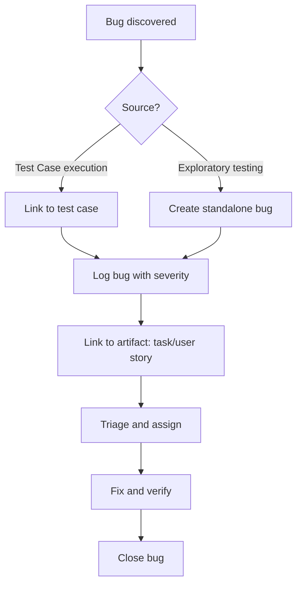
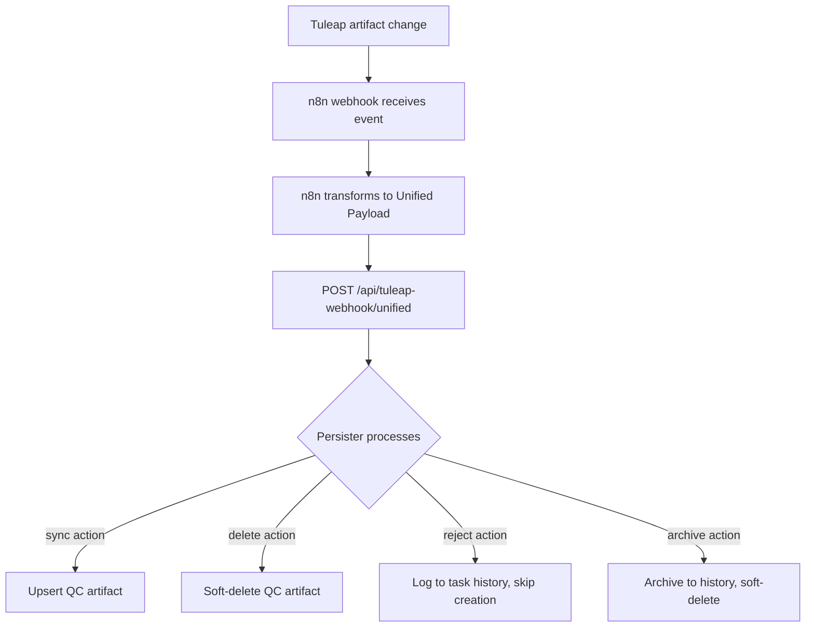
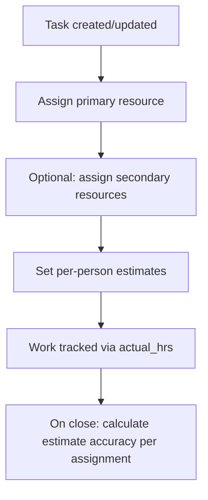

# Business Workflows

## Primary Workflow: Release Readiness

## Secondary Workflow: Quality Health Monitoring

## Test Execution Workflow

## Bug Lifecycle

## Tuleap Integration Workflow

## Task Assignment Workflow

