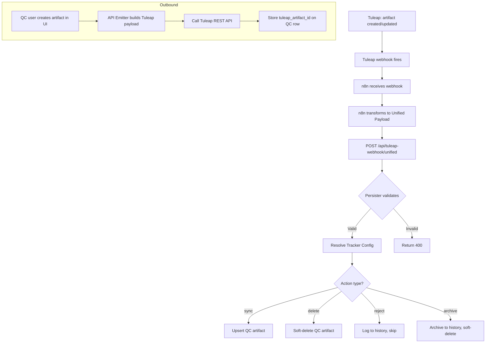

# Tuleap Integration

## 1. Purpose

Bidirectional artifact synchronization between Tuleap and QC-Manager. Mirrors Tuleap artifacts (bugs, tasks, user stories, test cases) into the QC database so QC can layer governance, analytics, and resource planning on top.

## 2. Users and Roles

| Role | Responsibility |
|------|---------------|
| Admin | Configure Tracker Configs, manage API credentials |
| PM | View synced artifacts in QC dashboards |
| Tester | Report bugs that sync to Tuleap; view synced test cases |
| Team Manager | Monitor synced tasks and resource assignments |

## 3. Business Value

Eliminates dual data entry between Tuleap and QC-Manager. Provides QC with a local copy of Tuleap artifacts for governance, test management, and reporting without modifying Tuleap workflows.

## 4. User Flow

## 5. Business Rules

| Rule ID | Rule | Priority |
|---------|------|----------|
| TUL-001 | Each artifact must have exactly one action per unified payload | Critical |
| TUL-002 | `reject` and `archive` actions only valid for `task` artifact_type | High |
| TUL-003 | Non-task artifact with task-only action returns 400 | High |
| TUL-004 | Deleted Tuleap artifacts result in soft-delete on QC side | High |
| TUL-005 | Tracker Config must exist for the (tracker_id, qc_project_id) pair | Critical |
| TUL-006 | Fields not in Tracker Config artifact_fields are silently dropped | Medium |
| TUL-007 | Bug source classification is immutable after first ingestion | Medium |

## 6. System Behavior

### Inbound: Tuleap → QC

1. n8n receives Tuleap webhook and transforms to Unified Payload
2. API validates payload with Zod schemas
3. API resolves Tracker Config by `(tracker_id, qc_project_id)`
4. API normalizes Tuleap field values to QC format
5. Persister executes the action:
   - `sync`: UPSERT by `tuleap_artifact_id`
   - `delete`: Set `deleted_at` timestamp
   - `reject`: Log to `tuleap_task_history`, return 200
   - `archive`: Archive to history, soft-delete

### Outbound: QC → Tuleap

1. QC user creates/edits artifact in web UI
2. API builds Tuleap-compatible payload using Tracker Config
3. API calls Tuleap REST API with `TULEAP_ACCESS_KEY`
4. Stores returned `tuleap_artifact_id` on QC row
5. Translates QC UUID artifact links to Tuleap integer IDs at boundary

## 7. Data and Configuration

| Field / Setting | Purpose | Required? |
|-----------------|---------|-----------|
| `tuleap_sync_config` row | Maps Tuleap tracker to QC project | Yes |
| `artifact_fields` | Field name mappings (Tuleap → QC) | Yes |
| `value_maps` | Multi-field status/value mappings (JSONB) | Yes |
| `TULEAP_BASE_URL` | Tuleap instance URL | Yes (for outbound) |
| `TULEAP_ACCESS_KEY` | Tuleap personal access key | Yes (for outbound) |
| `TULEAP_TRACKER_TASK` | Tracker ID for tasks | Yes (for outbound create) |
| `TULEAP_TRACKER_USER_STORY` | Tracker ID for user stories | Yes (for outbound create) |
| `TULEAP_TRACKER_TEST_CASE` | Tracker ID for test cases | Yes (for outbound create) |
| `TULEAP_TRACKER_BUG` | Tracker ID for bugs | Yes (for outbound create) |

## 8. Permissions and Security

| Action | Allowed Roles | Backend Enforcement? |
|--------|--------------|---------------------|
| View synced artifacts | All authenticated | Yes (scope-based) |
| Create Tuleap artifact from QC | pm, team_manager, tester | Yes (RBAC + TULEAP_ACCESS_KEY) |
| Configure Tracker Configs | admin | Yes |
| Receive inbound webhooks | n8n (service-to-service) | Yes (network-level + Unified Payload validation) |

## 9. Integrations

| Integration | Purpose | Failure Handling |
|-------------|---------|------------------|
| n8n | Webhook mediation, payload transformation | n8n retry; API returns 4xx/5xx for invalid payloads |
| Tuleap REST API | Outbound artifact creation/update | API returns error; artifact not created in Tuleap |
| Supabase PostgreSQL | Store synced artifacts | Standard DB error handling |

## 10. Edge Cases

| Scenario | Expected Behavior |
|----------|-------------------|
| Duplicate webhook (same tuleap_artifact_id, same content) | Idempotent UPSERT — no duplicate rows |
| Webhook for unknown tracker | 400 — no Tracker Config found |
| Tuleap deletes artifact, then recreates with same ID | New sync creates fresh row (old row has deleted_at) |
| Outbound create with invalid TULEAP_ACCESS_KEY | Tuleap returns 401; QC returns error to user |
| Artifact links to not-yet-synced artifact | Store as `pending_links` JSONB; resolve when linked artifact arrives (ADR 0006) |
| Field with no mapping in artifact_fields | Silently dropped from QC row |

## 11. Acceptance Criteria

| ID | Acceptance Criteria | Priority |
|----|--------------------|----------|
| AC-TUL-001 | Tuleap bug creation triggers QC bug creation via n8n webhook | Critical |
| AC-TUL-002 | Tuleap artifact update reflects in QC within sync window | Critical |
| AC-TUL-003 | Deleting artifact in Tuleap soft-deletes in QC | High |
| AC-TUL-004 | Non-task `reject` action returns 400 | High |
| AC-TUL-005 | QC user can create artifact in Tuleap from QC UI | High |
| AC-TUL-006 | Duplicate webhook payloads do not create duplicate rows | Medium |
| AC-TUL-007 | Missing Tracker Config returns clear error | Medium |

## 12. Current Implementation Status

| Capability | Status | Evidence | Notes |
|------------|--------|----------|-------|
| Inbound sync (all 4 types) | Implemented | Unified persister services in `src/services/persisters/` | ADR 0002 |
| Outbound creation | Implemented | Emitter services in `src/services/emitters/` | ADR 0004 |
| Unified Payload schema | Implemented | Zod schemas in `src/schemas/` | ADR 0001 |
| Value normalization | Implemented | `tuleapValueNormalizer.js` | ADR 0003 |
| Multi-field value maps | Implemented | JSONB `value_maps` column | ADR 0005 |
| QC UUID canonical links | Implemented | `pending_links` resolution | ADR 0006 |
| Zod in persisters | Implemented | Dual-schema (strict + deepPartial) | ADR 0007 |
| No auto-provisioning | Implemented | Admin must explicitly configure | ADR 0008 |
| Tracker Config UI | Planned / Roadmap | Phase 2 settings UI | Not yet built |

## 13. Open Questions

| Question | Owner | Impact | Required Decision |
|----------|-------|--------|------------------|
| Tracker Config UI timeline | PM | Admins currently must use direct DB inserts | Priority vs other features |
| n8n workflow resilience | DevOps | Single point of failure in sync chain | HA/retry strategy |
| API rate limiting for Tuleap | Architect | Tuleap may rate-limit bulk operations | Throttling strategy |

## 14. Related Documents

- [ADR Index](../internal/adr/README.md) — All Tuleap integration ADRs (0001-0008)
- [CONTEXT.md](../../CONTEXT.md) — Domain language and terminology
- [n8n Workflows](../technical/n8n-workflow-architecture.md) — n8n workflow architecture
- [Tuleap User Manual](../../docs/tuleap-integration-user-manual.md) — User-facing guide
