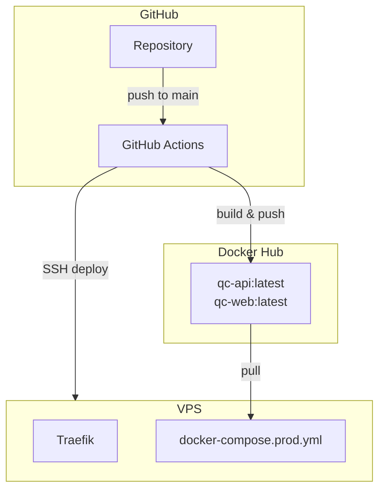

# Deployment

## Architecture



## Production Deployment

### Prerequisites

- Docker networks: `qc-shared-network`, `qc-network`
- Traefik connected to `qc-shared-network`
- Docker Hub images pushed
- `.env` from `.env.production.example`

### Deploy Steps

```bash
# 1. Create networks (one-time)
docker network create qc-shared-network
docker network create qc-network

# 2. Configure environment
cp .env.production.example .env
# Set all required values (see environment-variables.md)

# 3. Pull latest images
docker compose -f docker-compose.prod.yml pull

# 4. Start services
docker compose -f docker-compose.prod.yml up -d

# 5. Verify
docker compose -f docker-compose.prod.yml logs -f api
curl -f https://api.gerbil.qc/health
curl -I https://gerbil.qc/
```

### Post-Deploy

```bash
# Check migration status in API logs
docker compose -f docker-compose.prod.yml logs api | grep "migrations completed"

# Force recreate after image update
docker compose -f docker-compose.prod.yml up -d --force-recreate

# Clean old images
docker image prune -f
```

## Staging Deployment

```bash
cp .env.staging.example .env.staging
docker compose -p qc-staging -f docker-compose.staging.yml --env-file .env.staging up -d
```

## CI/CD (GitHub Actions)

`.github/workflows/deploy.yml` is **manual-only** (`workflow_dispatch`).

### How to Deploy via CI

```bash
gh workflow run "Build and Deploy to VPS" -f environment=production --ref main
```

### Required GitHub Secrets

| Secret | Purpose |
|--------|---------|
| `DOCKER_HUB_USERNAME`, `DOCKER_HUB_TOKEN` | Image registry auth |
| `VPS_HOST`, `VPS_SSH_PORT`, `VPS_USERNAME`, `VPS_SSH_KEY`, `SSH_PASSPHRASE` | VPS SSH access |
| `WEB_DOMAIN`, `API_DOMAIN` | Traefik routing |
| `JWT_SECRET` | Auth token signing |
| `SUPABASE_DATABASE_URL`, `SUPABASE_URL`, `SUPABASE_ANON_KEY`, `SUPABASE_SERVICE_ROLE_KEY`, `SUPABASE_JWT_SECRET` | Supabase connection |
| `QC_AGENT_WEBHOOK_SECRET` | AI/n8n landing content webhooks |
| `TULEAP_BASE_URL`, `TULEAP_ACCESS_KEY` | Tuleap integration |

## Container Details

| Service | Container | Port | Subdomain |
|---------|-----------|------|-----------|
| Web | qc-web | 3000 | gerbil.qc |
| API | qc-api | 3001 | api.gerbil.qc |
| n8n | qc-n8n | 5678 | n8n.gerbil.qc |
| PostgreSQL | qc-postgres | 5432 | (internal, n8n only) |

> [!IMPORTANT]
> Production containers do not expose ports directly. All traffic routes through Traefik.
> Production application data lives in Supabase PostgreSQL, not the local `qc-postgres` container.
> Web image bakes `NEXT_PUBLIC_*` vars at build time. Changing them requires rebuilding the web image.
