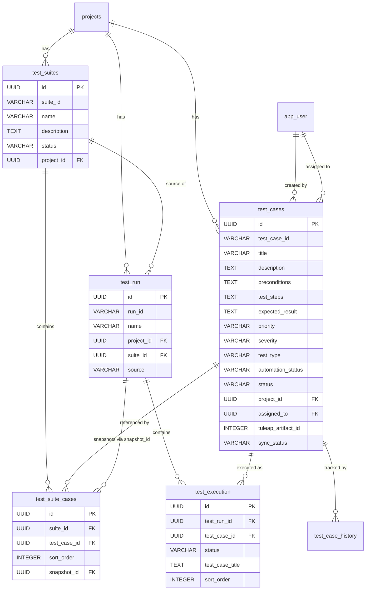
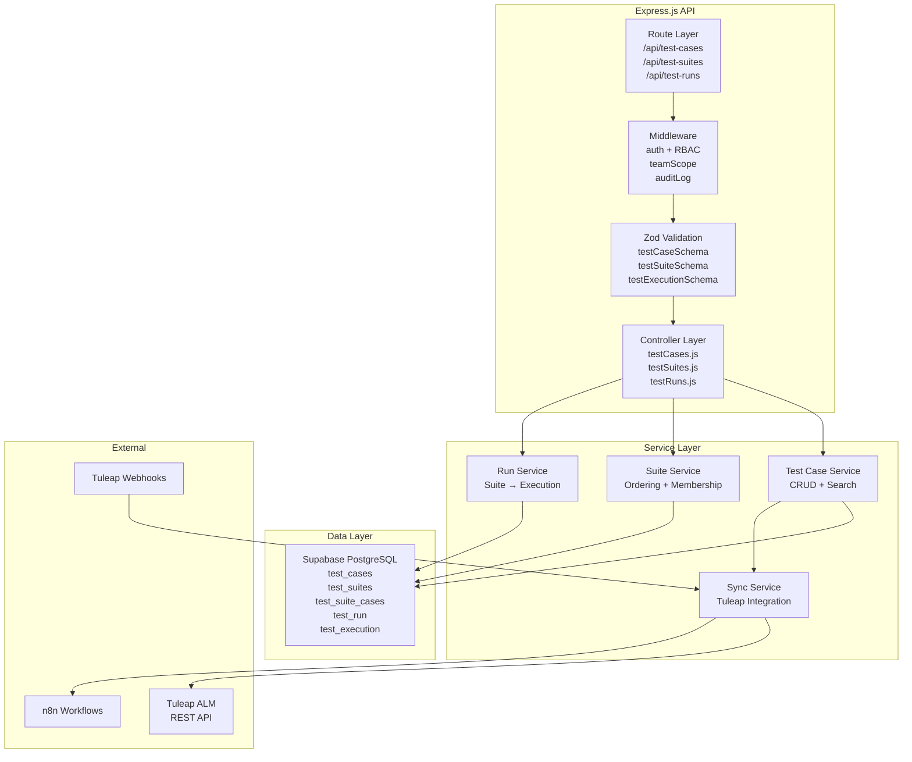
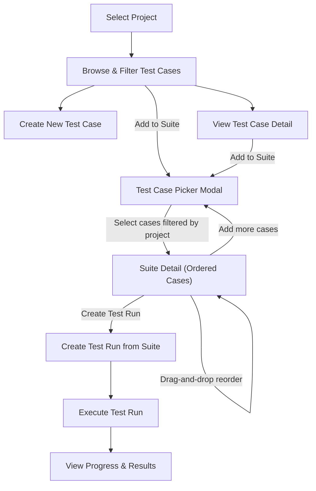
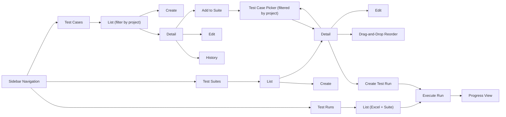
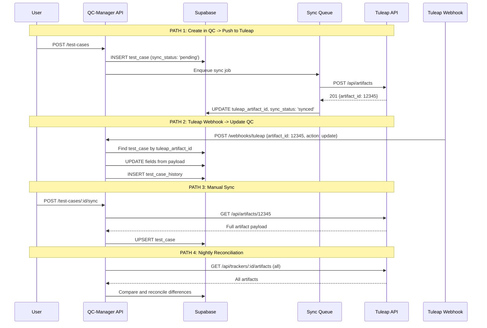

# QC-Manager: Test Case Management Module — Enterprise Design Document

---

## 1. Executive Summary

This document defines the complete architecture for the **Test Case Management** module within QC-Manager. The module introduces structured test case management, test suite organization, and enhanced test run creation — fully integrated with the existing Tuleap ALM synchronization layer.

**Key outcomes:**
- Unified test case table consolidating the existing `test_cases` and `test_case` tables
- Full CRUD with bidirectional Tuleap sync (webhooks + manual + nightly batch)
- Test Suite management with ordered, reusable test cases
- Suite-based test run creation alongside existing Excel upload
- Snapshot-on-use versioning for test suites
- Consistent with existing artifact patterns (Tasks, Bugs)

**Design decisions (confirmed):**

| Decision | Choice |
|----------|--------|
| Table strategy | Unified table (merge `test_cases` + `test_case`) |
| Excel upload | Keep both paths (Excel + suite-based) |
| Test steps | Simple text fields (not structured step objects) |
| Suite versioning | Snapshot on use |
| Tuleap sync | Real-time webhooks + manual sync + nightly batch |

---

## 2. Business Goals

| # | Goal | Measure |
|---|------|---------|
| G1 | Centralize test case management inside QC-Manager | All test cases created/edited in QC-Manager |
| G2 | Maintain Tuleap as source-of-truth for ALM artifacts | 100% bidirectional sync fidelity |
| G3 | Reduce manual test run creation effort | Suite-based auto-generation replaces manual Excel for structured testing |
| G4 | Enable test case reuse across projects/suites | Test cases assignable to multiple suites |
| G5 | Provide real-time visibility into test coverage | Dashboard widgets, pass/fail trends |
| G6 | Integrate with existing RBAC and project scoping | Zero permission regressions |

---

## 3. Functional Requirements

### 3.1 Test Case Management

| ID | Requirement | Priority |
|----|-------------|----------|
| TC-F01 | Create test case with all specified fields | P0 |
| TC-F02 | Edit test case (inline + full form) | P0 |
| TC-F03 | Delete test case (soft delete with confirmation) | P0 |
| TC-F04 | View test case detail page | P0 |
| TC-F05 | List test cases with server-side filtering, search, pagination | P0 |
| TC-F06 | Bulk create test cases | P1 |
| TC-F07 | Bulk update (status, priority, project) | P1 |
| TC-F08 | Bulk delete | P1 |
| TC-F09 | Duplicate test case | P1 |
| TC-F10 | Export test cases to CSV/Excel | P2 |
| TC-F11 | Import test cases from CSV | P2 |
| TC-F12 | Rich text for description and preconditions | P2 |
| TC-F13 | Test step attachments (screenshots, files) | P2 |

### 3.2 Test Suite Management

| ID | Requirement | Priority |
|----|-------------|----------|
| TS-F01 | Create test suite with name, description, project | P0 |
| TS-F02 | Add test cases to suite with ordering | P0 |
| TS-F03 | Remove test cases from suite | P0 |
| TS-F04 | Reorder test cases within suite (drag-and-drop) | P0 |
| TS-F05 | View suite detail with ordered test case list | P0 |
| TS-F06 | List suites with filtering and search | P0 |
| TS-F07 | Edit suite metadata | P1 |
| TS-F08 | Delete suite (soft delete, with cascade option) | P1 |
| TS-F09 | Reuse test case across multiple suites | P0 |
| TS-F10 | Clone/duplicate suite | P1 |
| TS-F11 | Snapshot suite composition when used in test run | P0 |
| TS-F12 | Search/filter test cases within suite | P1 |
| TS-F13 | Suite-level metrics (total cases, last run status) | P2 |

### 3.3 Test Run Enhancement

| ID | Requirement | Priority |
|----|-------------|----------|
| TR-F01 | Create test run from suite (auto-generate execution entries) | P0 |
| TR-F02 | Keep existing Excel upload path | P0 |
| TR-F03 | Execute test cases within a run (pass/fail/blocked/not_run) | P0 |
| TR-F04 | Assign tester to execution entries | P1 |
| TR-F05 | Bulk update execution statuses | P1 |
| TR-F06 | View test run progress (completion %) | P0 |
| TR-F07 | Link bugs to failed execution entries | P1 |
| TR-F08 | Test run dashboard with metrics | P1 |

### 3.4 Tuleap Synchronization

| ID | Requirement | Priority |
|----|-------------|----------|
| SY-F01 | Create in QC-Manager → sync to Tuleap | P0 |
| SY-F02 | Update in QC-Manager → sync to Tuleap | P0 |
| SY-F03 | Delete in QC-Manager → sync to Tuleap | P0 |
| SY-F04 | Webhook-driven real-time sync from Tuleap | P0 |
| SY-F05 | Manual "Sync Now" button per test case or per project | P0 |
| SY-F06 | Nightly batch reconciliation | P1 |
| SY-F07 | Conflict detection and resolution UI | P1 |
| SY-F08 | Sync status indicator on each test case | P0 |
| SY-F09 | Sync history/log view | P2 |
| SY-F10 | Retry failed syncs with exponential backoff | P0 |

---

## 3.5 Core Workflow: Test Cases → Suite → Test Run

The primary user journey in this module follows a three-stage pipeline. Every test run starts from test cases that are organized into suites.

```mermaid
flowchart TD
    Stage1["STAGE 1: Create & Manage Test Cases"] --> Stage2["STAGE 2: Organize into Test Suites"]
    Stage2 --> Stage3["STAGE 3: Execute via Test Runs"]

    subgraph S1["Stage 1: Test Cases"]
        CreateTC["Create Test Case<br/>(assigned to project)"] --> FilterTC["Browse & Filter<br/>by project, status,<br/>priority, type..."]
        FilterTC --> EditTC["Edit / Update<br/>Test Cases"]
        EditTC --> SyncTC["Sync with Tuleap<br/>(bi-directional)"]
    end

    subgraph S2["Stage 2: Test Suites"]
        CreateSuite["Create Suite<br/>(assigned to project)"] --> AddCases["Add Test Cases<br/>via Picker Modal"]
        AddCases --> FilterPicker["Filter within Picker<br/>by project, status,<br/>priority, type..."]
        FilterPicker --> SelectCases["Select & Add<br/>multiple cases at once"]
        SelectCases --> Reorder["Drag-and-Drop<br/>Reorder Cases"]
        SelectCases --> Reorder
    end

    subgraph S3["Stage 3: Test Runs"]
        CreateRun["Create Test Run<br/>from Suite"] --> Snapshot["Snapshot Suite<br/>Composition"]
        Snapshot --> Execute["Execute Each Case<br/>Pass / Fail / Blocked"]
        Execute --> Track["Track Progress<br/>& Completion %"]
        Track --> Complete["Mark Run Complete"]
    end

    AddCases -->|"Project-locked:<br/>only cases from same project"| FilterPicker
```



**Key design principle:** A test suite is **always scoped to a single project**. When adding test cases to a suite, the picker only shows test cases from that project. This ensures clean project boundaries and simplifies permission scoping.

**Stage 1 — Test Cases:** Users create test cases assigned to a project. They can browse and filter by project, status, priority, type, automation status, etc. Tuleap sync keeps cases consistent with the external ALM.

**Stage 2 — Test Suites:** Users create suites within a project, then use the **Test Case Picker Modal** to search, filter, and select test cases from the same project. The picker supports multi-select, pagination, and pre-excludes cases already in the suite. Suites preserve ordering via drag-and-drop.

**Stage 3 — Test Runs:** When ready to test, users create a run from a suite. The system snapshots the suite composition at that moment (so later edits to the suite don't affect running tests) and creates individual execution entries for each test case, preserving order.

---

## 3.6 Test Case Picker: Detailed Specification

The Test Case Picker is the **primary interface** for populating suites with test cases. It is a modal that opens from the suite detail page and allows users to search, filter, and select test cases from the suite's project.

### 3.6.1 How It Works

1. User navigates to Suite Detail (`/test-suites/:id`)
2. Suite is associated with **Project X**
3. User clicks **"+ Add Test Cases"** button
4. Modal opens, calling `GET /api/test-suites/:id/available-test-cases`
5. Results are **automatically scoped to Project X** — the project is derived from the suite
6. Test cases **already in the suite** are marked and cannot be re-selected
7. User applies filters (status, priority, type, automation, category, search) — all server-side
8. User selects one or more test cases using checkboxes
9. User clicks **"Add N Test Cases"** button
10. Modal calls `POST /api/test-suites/:id/test-cases` with selected IDs
11. Suite detail refreshes showing new cases appended at the end
12. Modal closes

### 3.6.2 Filter Controls in Picker

| Filter | Type | Source |
|--------|------|--------|
| Search | Text input | `search` query param — full-text on title, description, test_case_id |
| Status | Dropdown | `status` query param — draft, active, deprecated, archived |
| Priority | Dropdown | `priority` query param — critical, high, medium, low |
| Type | Dropdown | `test_type` query param — functional, regression, smoke, etc. |
| Automation | Dropdown | `automation_status` query param — manual, automated, partial, to_automate |
| Category | Dropdown | `category` query param — dynamic list from existing test cases in project |
| Already in suite | Auto-excluded | `exclude_in_suite=true` (default) — hides cases already in the suite |

### 3.6.3 Multi-Select Behavior

- Individual checkboxes for each test case row
- "Select All on Page" checkbox in table header
- Selected count persists across pagination (**"Selected: 3"** shown at bottom)
- Cases already in suite show **"(already in suite)"** badge — checkbox disabled
- Maximum 100 cases can be added in a single action (pagination limit)

---

## 4. Non-Functional Requirements

| ID | Requirement | Target |
|----|-------------|--------|
| NFR-01 | Test case list page load (50 items) | < 2 seconds |
| NFR-02 | Test case search response | < 500ms |
| NFR-03 | Suite-based test run creation (100 cases) | < 5 seconds |
| NFR-04 | Tuleap sync (single artifact) | < 3 seconds |
| NFR-05 | Concurrent users | 50 simultaneous |
| NFR-06 | Test cases per project | Up to 10,000 |
| NFR-07 | Suites per project | Up to 500 |
| NFR-08 | Test cases per suite | Up to 500 |
| NFR-09 | Data retention | Soft-deleted items retained indefinitely |
| NFR-10 | Audit trail completeness | 100% of CRUD operations logged |

---

## 5. Database Design

### 5.1 Unified `test_cases` Table (Replace both existing tables)

```sql
CREATE TABLE test_cases (
    -- Identity
    id                   UUID PRIMARY KEY DEFAULT uuid_generate_v4(),
    test_case_id         VARCHAR(50) NOT NULL,           -- Display ID: TC-XXXXX

    -- Core fields
    title                VARCHAR(500) NOT NULL,
    description          TEXT,
    preconditions        TEXT,
    test_steps           TEXT,                            -- Simple text field
    expected_result      TEXT,

    -- Classification
    priority             VARCHAR(20) NOT NULL DEFAULT 'medium'
                         CHECK (priority IN ('critical','high','medium','low')),
    severity             VARCHAR(20) DEFAULT 'normal'
                         CHECK (severity IN ('critical','major','normal','minor','trivial')),
    test_type            VARCHAR(50) DEFAULT 'functional'
                         CHECK (test_type IN ('functional','regression','smoke','integration',
                                             'performance','security','usability','exploratory','automated')),
    category             VARCHAR(50) DEFAULT 'other',
    component            VARCHAR(100),
    automation_status    VARCHAR(20) DEFAULT 'manual'
                         CHECK (automation_status IN ('manual','automated','partial','to_automate')),
    status               VARCHAR(50) NOT NULL DEFAULT 'draft'
                         CHECK (status IN ('draft','active','deprecated','archived')),

    -- Planning
    estimated_duration_minutes INTEGER,                 -- Estimated execution time
    tags                 TEXT[] DEFAULT '{}',

    -- Relationships
    project_id           UUID NOT NULL REFERENCES projects(id) ON DELETE CASCADE,
    linked_requirement_id VARCHAR(100),                 -- External requirement ID
    linked_bug_ids       UUID[] DEFAULT '{}',           -- Array of bug IDs
    assigned_to          UUID REFERENCES app_user(id) ON DELETE SET NULL,

    -- Audit
    created_by           UUID REFERENCES app_user(id) ON DELETE SET NULL,
    updated_by           UUID REFERENCES app_user(id) ON DELETE SET NULL,
    created_at           TIMESTAMPTZ NOT NULL DEFAULT CURRENT_TIMESTAMP,
    updated_at           TIMESTAMPTZ NOT NULL DEFAULT CURRENT_TIMESTAMP,
    deleted_at           TIMESTAMPTZ,                   -- Soft delete
    deleted_by           UUID REFERENCES app_user(id) ON DELETE SET NULL,

    -- Tuleap sync
    tuleap_artifact_id   INTEGER UNIQUE,
    tuleap_tracker_id    INTEGER,
    tuleap_url           TEXT,
    synced_from_tuleap   BOOLEAN DEFAULT FALSE,
    last_tuleap_sync     TIMESTAMPTZ,
    sync_status          VARCHAR(20) DEFAULT 'synced'
                         CHECK (sync_status IN ('synced','pending','conflict','error','not_synced')),
    sync_error_message   TEXT,
    pending_links        JSONB DEFAULT '[]',
    raw_tuleap_payload   JSONB,

    -- Legacy compatibility
    service_name         VARCHAR(100),
    task_number          VARCHAR(50),
    is_regression        BOOLEAN DEFAULT FALSE,
    execution_count      INTEGER DEFAULT 0,
    note                 TEXT
);
```

**Indexes:**

```sql
CREATE INDEX idx_test_cases_project_id ON test_cases(project_id) WHERE deleted_at IS NULL;
CREATE INDEX idx_test_cases_status ON test_cases(status) WHERE deleted_at IS NULL;
CREATE INDEX idx_test_cases_priority ON test_cases(priority) WHERE deleted_at IS NULL;
CREATE INDEX idx_test_cases_test_type ON test_cases(test_type) WHERE deleted_at IS NULL;
CREATE INDEX idx_test_cases_automation_status ON test_cases(automation_status) WHERE deleted_at IS NULL;
CREATE INDEX idx_test_cases_tuleap_artifact ON test_cases(tuleap_artifact_id) WHERE tuleap_artifact_id IS NOT NULL;
CREATE INDEX idx_test_cases_sync_status ON test_cases(sync_status) WHERE sync_status != 'synced';
CREATE INDEX idx_test_cases_assigned_to ON test_cases(assigned_to) WHERE deleted_at IS NULL;
CREATE INDEX idx_test_cases_created_by ON test_cases(created_by) WHERE deleted_at IS NULL;
CREATE INDEX idx_test_cases_tags ON test_cases USING GIN(tags) WHERE deleted_at IS NULL;
CREATE INDEX idx_test_cases_search ON test_cases USING gin(to_tsvector('english', coalesce(title,'') || ' ' || coalesce(description,'')));
CREATE INDEX idx_test_cases_test_case_id ON test_cases(test_case_id) WHERE deleted_at IS NULL;
```

### 5.2 `test_suites` Table (New)

```sql
CREATE TABLE test_suites (
    -- Identity
    id                   UUID PRIMARY KEY DEFAULT uuid_generate_v4(),
    suite_id             VARCHAR(50) NOT NULL,           -- Display ID: TS-XXXXX

    -- Core fields
    name                 VARCHAR(255) NOT NULL,
    description          TEXT,

    -- Classification
    status               VARCHAR(50) NOT NULL DEFAULT 'active'
                         CHECK (status IN ('draft','active','archived')),

    -- Relationships
    project_id           UUID NOT NULL REFERENCES projects(id) ON DELETE CASCADE,
    created_by           UUID REFERENCES app_user(id) ON DELETE SET NULL,
    updated_by           UUID REFERENCES app_user(id) ON DELETE SET NULL,

    -- Audit
    created_at           TIMESTAMPTZ NOT NULL DEFAULT CURRENT_TIMESTAMP,
    updated_at           TIMESTAMPTZ NOT NULL DEFAULT CURRENT_TIMESTAMP,
    deleted_at           TIMESTAMPTZ,
    deleted_by           UUID REFERENCES app_user(id) ON DELETE SET NULL
);
```

**Indexes:**

```sql
CREATE INDEX idx_test_suites_project_id ON test_suites(project_id) WHERE deleted_at IS NULL;
CREATE INDEX idx_test_suites_status ON test_suites(status) WHERE deleted_at IS NULL;
CREATE INDEX idx_test_suites_created_by ON test_suites(created_by) WHERE deleted_at IS NULL;
CREATE INDEX idx_test_suites_suite_id ON test_suites(suite_id) WHERE deleted_at IS NULL;
```

### 5.3 `test_suite_cases` Junction Table (New — Ordered)

```sql
CREATE TABLE test_suite_cases (
    id                   UUID PRIMARY KEY DEFAULT uuid_generate_v4(),
    suite_id             UUID NOT NULL REFERENCES test_suites(id) ON DELETE CASCADE,
    test_case_id         UUID NOT NULL REFERENCES test_cases(id) ON DELETE CASCADE,
    sort_order           INTEGER NOT NULL DEFAULT 0,     -- Ordering position (0-based)

    -- Snapshot support: null = current, value = test_run.id when snapshotted
    snapshot_id          UUID,

    created_at           TIMESTAMPTZ NOT NULL DEFAULT CURRENT_TIMESTAMP
);

-- For active suite membership (no snapshot)
CREATE UNIQUE INDEX idx_test_suite_cases_active
    ON test_suite_cases(suite_id, test_case_id)
    WHERE snapshot_id IS NULL;

-- For snapshot retrieval
CREATE INDEX idx_test_suite_cases_snapshot
    ON test_suite_cases(snapshot_id)
    WHERE snapshot_id IS NOT NULL;
```

### 5.4 Enhanced `test_run` Table (Alter Existing)

```sql
ALTER TABLE test_run ADD COLUMN IF NOT EXISTS suite_id UUID REFERENCES test_suites(id) ON DELETE SET NULL;
ALTER TABLE test_run ADD COLUMN IF NOT EXISTS created_by_email VARCHAR(255);
ALTER TABLE test_run ADD COLUMN IF NOT EXISTS environment VARCHAR(100);
ALTER TABLE test_run ADD COLUMN IF NOT EXISTS version_tag VARCHAR(50);
ALTER TABLE test_run ADD COLUMN IF NOT EXISTS source VARCHAR(20) DEFAULT 'excel'
    CHECK (source IN ('excel','suite'));
```

### 5.5 Enhanced `test_execution` Table (Alter Existing)

```sql
ALTER TABLE test_execution ADD COLUMN IF NOT EXISTS test_case_title VARCHAR(500);
ALTER TABLE test_execution ADD COLUMN IF NOT EXISTS test_case_steps TEXT;
ALTER TABLE test_execution ADD COLUMN IF NOT EXISTS expected_result TEXT;
ALTER TABLE test_execution ADD COLUMN IF NOT EXISTS sort_order INTEGER DEFAULT 0;
ALTER TABLE test_execution ADD COLUMN IF NOT EXISTS assigned_to UUID REFERENCES app_user(id) ON DELETE SET NULL;
```

### 5.6 `test_case_history` Table (New — Audit Trail)

```sql
CREATE TABLE test_case_history (
    id                   UUID PRIMARY KEY DEFAULT uuid_generate_v4(),
    test_case_id         UUID NOT NULL REFERENCES test_cases(id) ON DELETE CASCADE,
    action               VARCHAR(50) NOT NULL,           -- created, updated, deleted, restored, synced
    changed_fields       TEXT[],
    before_state         JSONB,
    after_state          JSONB,
    change_summary       TEXT,
    performed_by         UUID REFERENCES app_user(id) ON DELETE SET NULL,
    performed_by_email   VARCHAR(255),
    performed_at         TIMESTAMPTZ NOT NULL DEFAULT CURRENT_TIMESTAMP
);

CREATE INDEX idx_test_case_history_case ON test_case_history(test_case_id);
CREATE INDEX idx_test_case_history_performed_at ON test_case_history(performed_at DESC);
```

### 5.7 Entity Relationship Diagram



---

## 6. API Design

### 6.1 Test Cases API

#### `GET /api/test-cases`

List test cases with filtering and pagination.

**Query Parameters:**

| Param | Type | Description |
|-------|------|-------------|
| `page` | integer | Page number (default: 1) |
| `limit` | integer | Items per page (default: 25, max: 100) |
| `search` | string | Full-text search on title, description |
| `project_id` | UUID | Filter by project |
| `status` | string | draft, active, deprecated, archived |
| `priority` | string | critical, high, medium, low |
| `test_type` | string | functional, regression, smoke, etc. |
| `automation_status` | string | manual, automated, partial, to_automate |
| `assigned_to` | UUID | Filter by assignee |
| `tags` | string[] | Filter by tags (ANY match) |
| `sync_status` | string | synced, pending, conflict, error |
| `sort_by` | string | created_at, updated_at, title, priority |
| `sort_order` | string | asc, desc |

**Response:**

```json
{
  "data": [
    {
      "id": "uuid",
      "test_case_id": "TC-00042",
      "title": "Verify login with valid credentials",
      "description": "Test the standard login flow...",
      "preconditions": "User account exists",
      "test_steps": "1. Navigate to login page\n2. Enter valid email\n3. Enter valid password\n4. Click Login",
      "expected_result": "User is redirected to dashboard",
      "priority": "high",
      "severity": "critical",
      "test_type": "functional",
      "category": "Authentication",
      "component": "Login Module",
      "automation_status": "automated",
      "status": "active",
      "estimated_duration_minutes": 5,
      "tags": ["smoke", "login", "p1"],
      "project_id": "uuid",
      "project_name": "Project Alpha",
      "assigned_to": "uuid",
      "assigned_to_name": "John Doe",
      "created_by": "uuid",
      "created_by_name": "Jane Smith",
      "updated_by": "uuid",
      "created_at": "2026-01-15T10:30:00Z",
      "updated_at": "2026-02-20T14:15:00Z",
      "tuleap_artifact_id": 12345,
      "tuleap_url": "https://tuleap.example.com/plugins/tracker/?aid=12345",
      "sync_status": "synced",
      "last_tuleap_sync": "2026-02-20T14:15:00Z",
      "latest_execution_status": "passed",
      "latest_execution_date": "2026-03-01T09:00:00Z",
      "execution_count": 12
    }
  ],
  "pagination": {
    "page": 1,
    "limit": 25,
    "total": 156,
    "total_pages": 7
  }
}
```

#### `GET /api/test-cases/:id`

Get single test case detail (same shape as list item, plus `raw_tuleap_payload`).

#### `POST /api/test-cases`

Create a test case.

**Request:**

```json
{
  "title": "Verify login with valid credentials",
  "description": "Test the standard login flow with valid credentials",
  "preconditions": "User account must exist in the system",
  "test_steps": "1. Navigate to login page\n2. Enter valid email\n3. Enter valid password\n4. Click Login button",
  "expected_result": "User is redirected to the dashboard page",
  "priority": "high",
  "severity": "critical",
  "test_type": "functional",
  "category": "Authentication",
  "component": "Login Module",
  "automation_status": "manual",
  "status": "draft",
  "estimated_duration_minutes": 5,
  "tags": ["smoke", "login"],
  "project_id": "uuid",
  "assigned_to": "uuid",
  "linked_requirement_id": "REQ-001",
  "linked_bug_ids": []
}
```

**Response:** `201 Created` with full test case object.

**Side effects:** If project has Tuleap sync config with `tracker_type = 'test_case'`, triggers async sync to Tuleap.

#### `PATCH /api/test-cases/:id`

Update test case (partial update — dynamic PATCH like existing tasks).

**Request:** Any subset of writable fields.

```json
{
  "status": "active",
  "priority": "critical",
  "automation_status": "automated",
  "tags": ["smoke", "login", "regression"]
}
```

**Response:** `200 OK` with full updated test case.

**Side effects:** Triggers Tuleap sync if field is mapped.

#### `DELETE /api/test-cases/:id`

Soft delete test case.

**Response:** `204 No Content`

**Side effects:** Sets `deleted_at`, triggers Tuleap sync (if applicable).

#### `POST /api/test-cases/bulk`

Bulk operations.

```json
{
  "action": "update",
  "ids": ["uuid1", "uuid2", "uuid3"],
  "data": {
    "status": "active",
    "priority": "high"
  }
}
```

**Actions:** `update`, `delete`, `assign`, `add_tags`, `remove_tags`

#### `POST /api/test-cases/:id/duplicate`

Clone a test case.

```json
{
  "title": "Copy of Verify login",
  "project_id": "uuid"
}
```

#### `POST /api/test-cases/:id/sync`

Manual sync trigger.

```json
{
  "direction": "push"
}
```

**Directions:** `push` (QC→Tuleap), `pull` (Tuleap→QC), `bidirectional`

### 6.2 Test Suites API

#### `GET /api/test-suites`

List suites.

**Query Parameters:**

| Param | Type | Description |
|-------|------|-------------|
| `page` | integer | Page number |
| `limit` | integer | Items per page |
| `search` | string | Search name, description |
| `project_id` | UUID | Filter by project |
| `status` | string | draft, active, archived |
| `sort_by` | string | name, created_at, updated_at |
| `sort_order` | string | asc, desc |

**Response:**

```json
{
  "data": [
    {
      "id": "uuid",
      "suite_id": "TS-00012",
      "name": "Login & Authentication Suite",
      "description": "All login-related test cases",
      "status": "active",
      "project_id": "uuid",
      "project_name": "Project Alpha",
      "test_case_count": 15,
      "created_by": "uuid",
      "created_by_name": "Jane Smith",
      "created_at": "2026-01-15T10:30:00Z",
      "updated_at": "2026-02-20T14:15:00Z",
      "last_run_date": "2026-03-01T09:00:00Z",
      "last_run_pass_rate": 93.3
    }
  ],
  "pagination": { "page": 1, "limit": 25, "total": 45, "total_pages": 2 }
}
```

#### `GET /api/test-suites/:id`

Get suite detail with ordered test cases.

**Response:**

```json
{
  "id": "uuid",
  "suite_id": "TS-00012",
  "name": "Login & Authentication Suite",
  "description": "All login-related test cases",
  "status": "active",
  "project_id": "uuid",
  "project_name": "Project Alpha",
  "test_cases": [
    {
      "id": "uuid",
      "test_case_id": "TC-00042",
      "title": "Verify login with valid credentials",
      "priority": "high",
      "status": "active",
      "sort_order": 0,
      "latest_execution_status": "passed"
    }
  ],
  "created_by": "uuid",
  "created_at": "2026-01-15T10:30:00Z",
  "updated_at": "2026-02-20T14:15:00Z"
}
```

#### `POST /api/test-suites`

Create suite.

```json
{
  "name": "Login & Authentication Suite",
  "description": "All login-related test cases",
  "project_id": "uuid",
  "status": "draft",
  "test_case_ids": ["uuid1", "uuid2", "uuid3"]
}
```

#### `PATCH /api/test-suites/:id`

Update suite metadata (name, description, status). For test case membership, use the dedicated endpoints below.

#### `DELETE /api/test-suites/:id`

Soft delete suite. Junction entries cascade deleted.

#### `POST /api/test-suites/:id/test-cases`

Add test cases to suite (with ordering).

**Important:** Test cases must belong to the same project as the suite. The API validates `test_case.project_id === suite.project_id` and rejects mismatches with `403`.

```json
{
  "test_case_ids": ["uuid1", "uuid2"],
  "position": "end"
}
```

**Positions:** `end` (append), `start` (prepend), number (specific index).

**Behavior:**
- IDs already in the suite are silently skipped (no error, no duplicate).
- Returns updated suite with full ordered test case list.
- Audit log entry: `test_suite.case_added` for each new case.

#### `GET /api/test-suites/:id/available-test-cases`

Search test cases **within the suite's project** that can be added to the suite. This is the endpoint backing the Test Case Picker Modal.

**Query Parameters:**

| Param | Type | Description |
|-------|------|-------------|
| `search` | string | Full-text search on title, description |
| `status` | string | draft, active, deprecated, archived |
| `priority` | string | critical, high, medium, low |
| `test_type` | string | functional, regression, smoke, etc. |
| `automation_status` | string | manual, automated, partial, to_automate |
| `category` | string | Filter by category |
| `exclude_in_suite` | boolean | Default `true` — exclude cases already in this suite |
| `page` | integer | Page number (default: 1) |
| `limit` | integer | Items per page (default: 25) |

**Response:**

```json
{
  "data": [
    {
      "id": "uuid",
      "test_case_id": "TC-00047",
      "title": "Search returns correct results",
      "priority": "medium",
      "status": "active",
      "test_type": "functional",
      "automation_status": "manual",
      "category": "Search",
      "already_in_suite": false
    }
  ],
  "pagination": { "page": 1, "limit": 25, "total": 45, "total_pages": 2 }
}
```

**Key behavior:** This endpoint **automatically scopes to the suite's project** — the `project_id` is derived from the suite, not from the query. Users cannot add test cases from other projects.

#### `DELETE /api/test-suites/:id/test-cases`

Remove test cases from suite.

```json
{
  "test_case_ids": ["uuid1"]
}
```

#### `PATCH /api/test-suites/:id/reorder`

Reorder test cases within suite.

```json
{
  "ordered_test_case_ids": ["uuid3", "uuid1", "uuid2"]
}
```

This sets `sort_order` = array index for each.

#### `POST /api/test-suites/:id/clone`

Clone a suite.

```json
{
  "name": "Copy of Login Suite",
  "project_id": "uuid",
  "copy_test_cases": true
}
```

### 6.3 Test Runs (Enhanced) API

#### `POST /api/test-runs/from-suite`

Create a test run from a suite.

```json
{
  "suite_id": "uuid",
  "name": "Sprint 15 - Login Suite",
  "project_id": "uuid",
  "environment": "staging",
  "version_tag": "v2.3.1"
}
```

**Behavior:**
1. Fetch all active test cases from suite (ordered by `sort_order`)
2. Snapshot suite composition (create `test_suite_cases` entries with `snapshot_id` = new run ID)
3. Create `test_run` record with `source = 'suite'`
4. Create `test_execution` entries for each test case (status = `not_run`)
5. Return the created run with execution entries

**Response:**

```json
{
  "id": "uuid",
  "run_id": "TR-00089",
  "name": "Sprint 15 - Login Suite",
  "suite_id": "uuid",
  "project_id": "uuid",
  "status": "in_progress",
  "source": "suite",
  "environment": "staging",
  "version_tag": "v2.3.1",
  "total_cases": 15,
  "passed": 0,
  "failed": 0,
  "blocked": 0,
  "not_run": 15,
  "pass_rate": 0,
  "execution_entries": [
    {
      "id": "uuid",
      "test_case_id": "uuid",
      "test_case_title": "Verify login with valid credentials",
      "test_case_steps": "...",
      "expected_result": "...",
      "sort_order": 0,
      "status": "not_run",
      "assigned_to": null
    }
  ],
  "created_at": "2026-03-15T10:00:00Z"
}
```

#### `GET /api/test-runs/:id/executions`

Get all execution entries for a run.

#### `PATCH /api/test-executions/:id`

Update a single execution (status, notes, assignee).

```json
{
  "status": "passed",
  "notes": "All steps passed successfully",
  "duration_seconds": 180,
  "defect_ids": []
}
```

#### `POST /api/test-runs/:id/executions/bulk`

Bulk update executions.

```json
{
  "execution_ids": ["uuid1", "uuid2", "uuid3"],
  "status": "passed",
  "assigned_to": "uuid"
}
```

#### `GET /api/test-runs/:id/progress`

Get run progress summary.

```json
{
  "total": 15,
  "passed": 10,
  "failed": 2,
  "blocked": 1,
  "not_run": 2,
  "pass_rate": 76.9,
  "completion_rate": 86.7,
  "estimated_remaining_minutes": 8
}
```

### 6.4 Sync API

#### `POST /api/sync/tuleap/test-cases/push`

Push local changes to Tuleap.

```json
{
  "test_case_ids": ["uuid1", "uuid2"],
  "force": false
}
```

#### `POST /api/sync/tuleap/test-cases/pull`

Pull from Tuleap.

```json
{
  "project_id": "uuid",
  "tuleap_tracker_id": 123
}
```

#### `POST /api/sync/tuleap/test-cases/reconcile`

Nightly reconciliation job trigger.

#### `GET /api/sync/tuleap/test-cases/status`

Get sync status summary.

```json
{
  "total": 156,
  "synced": 140,
  "pending": 8,
  "conflict": 3,
  "error": 2,
  "not_synced": 3,
  "last_batch_sync": "2026-03-14T02:00:00Z"
}
```

---

## 7. Architecture

### 7.1 Backend Architecture



**File structure (following existing pattern):**

```
apps/api/src/
├── routes/
│   ├── test-cases.js          (enhanced CRUD + sync endpoints)
│   ├── test-suites.js         (new — suite CRUD + membership)
│   ├── test-runs.js           (enhanced — add from-suite endpoint)
│   └── test-executions.js     (enhanced — bulk updates)
├── schemas/
│   ├── testCase.js            (new Zod schema)
│   ├── testSuite.js           (new Zod schema)
│   └── testExecution.js       (enhanced Zod schema)
├── services/
│   ├── testCaseService.js     (new — business logic)
│   ├── suiteService.js        (new — suite ordering)
│   ├── runService.js          (new — run creation from suite)
│   └── syncService.js         (new — Tuleap sync logic)
├── middleware/
│   ├── auth.js                (existing — add new permissions)
│   └── audit.js               (existing — add test_case/test_suite entities)
└── utils/
    └── syncQueue.js           (new — sync job queue with retry)
```

### 7.2 Frontend Architecture

**New pages following existing App Router pattern:**

```
apps/web/app/
├── test-cases/
│   ├── page.tsx               (enhanced list — TanStack table, server-side filters)
│   ├── create/page.tsx        (enhanced create form)
│   └── [id]/
│       ├── page.tsx           (detail view with history)
│       └── edit/page.tsx      (edit form)
├── test-suites/               (NEW)
│   ├── page.tsx               (suite list)
│   ├── create/page.tsx        (create suite)
│   └── [id]/
│       ├── page.tsx           (suite detail — ordered test cases, drag-and-drop)
│       └── edit/page.tsx      (edit suite metadata)
├── test-executions/
│   ├── page.tsx               (enhanced — keep Excel upload + add suite-based creation)
│   └── [runId]/
│       └── page.tsx           (NEW — test run execution view)
└── test-results/
    └── page.tsx               (existing — minor updates)
```

**New components:**

```
apps/web/src/components/
├── test-cases/
│   ├── TestCaseTable.tsx      (TanStack React Table — replace raw HTML table)
│   ├── TestCaseForm.tsx       (enhanced — add all new fields)
│   └── TestCaseFilters.tsx    (extracted filter component)
├── test-suites/
│   ├── SuiteTable.tsx         (suite list table)
│   ├── SuiteDetail.tsx        (ordered test case list with drag-and-drop)
│   ├── SuiteForm.tsx          (create/edit form)
│   ├── SuiteCaseList.tsx      (sortable test case list within suite)
│   └── SuiteCasePicker.tsx    (modal to add test cases to suite — project-scoped search, filter, multi-select)
└── test-runs/
    ├── RunFromSuiteForm.tsx   (form: select suite → create run)
    ├── RunExecutionTable.tsx  (execution entries with inline status update)
    └── RunProgressBar.tsx     (visual progress indicator)
```

### 7.3 Key Component: SuiteCasePicker.tsx

This is the **most important new component** — it bridges test cases to suites and is the primary way users compose test coverage.

**Props:**

```typescript
interface SuiteCasePickerProps {
  suiteId: string;
  projectId: string;           // Auto-locked to suite's project
  isOpen: boolean;
  onClose: () => void;
  onCasesAdded: (caseIds: string[]) => void;  // Refreshes parent suite detail
}
```

**State:**

```typescript
interface PickerState {
  search: string;
  status: string;
  priority: string;
  testType: string;
  automationStatus: string;
  category: string;
  page: number;
  selectedIds: Set<string>;     // Persists across pagination
  availableCases: TestCase[];   // From GET /api/test-suites/:id/available-test-cases
  totalCount: number;
  isLoading: boolean;
}
```

**Behavior:**
1. On mount, calls `GET /api/test-suites/:id/available-test-cases` with default filters
2. Project is **derived from suite** — not selectable by user
3. Cases already in suite are shown with disabled checkbox and "(already in suite)" badge
4. Multi-select persists across page changes via `selectedIds: Set<string>`
5. "Select All on Page" checkbox selects/deselects all **available** (not already-in-suite) cases on current page
6. Bottom bar shows "Selected: N test cases" with Cancel and Add buttons
7. On "Add", calls `POST /api/test-suites/:id/test-cases` with `{ test_case_ids: [...selectedIds] }`
8. On success, calls `onCasesAdded([...selectedIds])` which refreshes the parent suite detail

**Uses existing components:** `Badge` for status/priority, `Select` for filter dropdowns, `Input` for search, `Pagination` for page navigation.

---

## 8. UI/UX Design

### 8.1 Navigation Updates

Add to sidebar navigation:

| navOrder | Path | Label | Icon | Permission |
|----------|------|-------|------|------------|
| 7.5 | `/test-suites` | Test Suites | `Layers` | `page:test-suites` |
| Update | `/test-cases` | Test Cases | `FlaskConical` | `page:test-cases` |

**Note:** Test Cases currently not in navbar. Promote it to visible nav item.

### 8.2 Screen Breakdowns

#### Screen 1: Test Cases List (`/test-cases`)

```
┌─────────────────────────────────────────────────────────────────┐
│  Test Cases                                    [+ New] [Import] │
├─────────────────────────────────────────────────────────────────┤
│  Search: [________________]                                     │
│  Project: [All v] Status: [All v] Priority: [All v]             │
│  Type: [All v] Automation: [All v] Sync: [All v]   [Clear]     │
│  Showing 1-25 of 156 test cases                                 │
├─────────────────────────────────────────────────────────────────┤
│  [] | TC-00042 | Verify login... | Auth | High | Active | Sync  │
│  [] | TC-00043 | Verify logout.. | Auth | Med  | Active | Sync  │
│  [] | TC-00044 | Password reset  | Auth | High | Draft  | Pend  │
│  ...                                                            │
├─────────────────────────────────────────────────────────────────┤
│  [Bulk: Update | Delete | Assign]   Page 1 of 7   [< 1 2 ...>] │
└─────────────────────────────────────────────────────────────────┘
```

**Key interactions:**
- Click row → navigate to detail
- Checkbox → enable bulk actions
- Column headers → sort (client-side for loaded page)
- Filter dropdowns → server-side filtering
- Status/priority/sync badges use existing `Badge` component variants

#### Screen 2: Test Case Detail (`/test-cases/[id]`)

```
┌─────────────────────────────────────────────────────────────────┐
│  <- Back to Test Cases           TC-00042          [Edit] [...]  │
├─────────────────────────────────────────────────────────────────┤
│  Verify login with valid credentials                            │
│  [Active]  [High]  [Critical]  [Automated]                      │
│                                                                 │
│  Project: Project Alpha    Assigned: John Doe                   │
│  Type: Functional          Category: Authentication             │
│  Component: Login Module   Tags: smoke, login, p1              │
│  Est. Duration: 5 min      Linked Req: REQ-001                  │
│                                                                 │
│  -- Description ----------------------------------------------  │
│  Test the standard login flow with valid credentials...         │
│                                                                 │
│  -- Preconditions --------------------------------------------- │
│  User account must exist in the system.                         │
│                                                                 │
│  -- Test Steps ------------------------------------------------ │
│  1. Navigate to login page                                      │
│  2. Enter valid email                                           │
│  3. Enter valid password                                        │
│  4. Click Login button                                          │
│                                                                 │
│  -- Expected Result ------------------------------------------- │
│  User is redirected to the dashboard page.                      │
│                                                                 │
│  -- Sync Status ----------------------------------------------- │
│  Tuleap Artifact: #12345  [Sync Now]                            │
│  Last Synced: 2026-02-20 14:15 UTC                              │
│                                                                 │
│  -- Execution History -----------------------------------------  │
│  Date         Run         Status    Tester                      │
│  2026-03-01   TR-00088   Pass      John Doe                     │
│  2026-02-15   TR-00076   Fail      Jane Smith                   │
│                                                                 │
│  -- Activity -------------------------------------------------- │
│  2026-02-20 14:15 - Jane Smith updated priority: medium -> high │
│  2026-01-15 10:30 - Jane Smith created test case                │
└─────────────────────────────────────────────────────────────────┘
```

#### Screen 3: Test Suites List (`/test-suites`)

```
┌─────────────────────────────────────────────────────────────────┐
│  Test Suites                                    [+ New Suite]   │
├─────────────────────────────────────────────────────────────────┤
│  Search: [________________]                                     │
│  Project: [All v] Status: [All v]                  [Clear]      │
├─────────────────────────────────────────────────────────────────┤
│  TS-00012 | Login & Auth Suite    | 15 cases | Active | 93%    │
│  TS-00013 | Payment Flow Suite    | 22 cases | Active | 78%    │
│  TS-00014 | User Management Suite | 8 cases  | Draft  | --     │
│  ...                                                            │
├─────────────────────────────────────────────────────────────────┤
│  Page 1 of 2   [< 1 2 >]                                       │
└─────────────────────────────────────────────────────────────────┘
```

#### Screen 4: Suite Detail with Drag-and-Drop (`/test-suites/[id]`)

```
┌─────────────────────────────────────────────────────────────────┐
│  <- Back to Suites  Login & Auth Suite (TS-00012)  [Edit] [...] │
├─────────────────────────────────────────────────────────────────┤
│  Project: Alpha  |  15 test cases  |  Last run: 93% pass rate  │
│                                                                 │
│  [+ Add Test Cases]                                    [Create] │
│  +----------------------------------------------------------+   │
│  | =  1. TC-00042  Verify login with valid cred...  High     |   │
│  | =  2. TC-00043  Verify logout functionality      Med      |   │
│  | =  3. TC-00044  Password reset flow              High     |   │
│  | =  4. TC-00045  Account lockout after 5 attempts High     |   │
│  | =  5. TC-00046  Remember me functionality        Low      |   │
│  |    ...                                                    |   │
│  |                                                           |   │
│  |  Search within suite: [________________]                  |   │
│  +----------------------------------------------------------+   │
│                                                                 │
│  [Create Test Run from Suite]                                   │
└─────────────────────────────────────────────────────────────────┘
```

**Drag-and-drop:** Use `@dnd-kit/core` library (lightweight, accessible, React-friendly). Each row has a grip handle (=). On drop, call `PATCH /api/test-suites/:id/reorder`.

#### Screen 4.5: Test Case Picker Modal (opens from Suite Detail)

This is the **primary workflow** for populating a suite. When the user clicks `[+ Add Test Cases]` on the suite detail page, a modal opens allowing them to **search and filter test cases within the project** and select which ones to add.

```
+--------------------------------------------------------------+
|  Add Test Cases to Suite: "Login & Auth Suite"                |
|  Project: Alpha                                               |
|                                                               |
|  Search: [________________________]                           |
|  Status: [All v] Priority: [All v] Type: [All v]             |
|  Automation: [All v] Category: [All v]           [Clear]      |
|                                                               |
|  Showing 48 of 156 test cases in project Alpha                |
|  (3 already in suite, 45 available)                           |
|                                                               |
|  [x] TC-00042  Verify login with valid cred...  High  Active  |
|  [x] TC-00043  Verify logout functionality      Med   Active  |
|  [ ] TC-00047  Search returns correct results   Med   Active  |
|  [ ] TC-00048  User profile update flow          Low   Active  |
|  [ ] TC-00049  Password complexity requirements  High  Draft   |
|  ...                                                          |
|                                                               |
|  Selected: 2 test cases                     [Cancel] [Add 2]  |
+--------------------------------------------------------------+
```

**Key behaviors:**
- **Project-locked**: The modal auto-filters to the suite's project. Users cannot add test cases from other projects.
- **Excludes already-added**: Test cases already in the suite are marked with a badge "(already in suite)" and cannot be re-selected.
- **Multi-select with checkbox**: Users can select multiple test cases at once using individual checkboxes or "Select All on Page".
- **Server-side filtering**: All filters are applied via the API (`GET /api/test-cases?project_id=X&status=active...`), not client-side.
- **Search**: Full-text search across title, description, and test_case_id.
- **Selected items persist** if user pages through results. A "Selected: N" counter stays visible at the bottom.
- **Add button** calls `POST /api/test-suites/:id/test-cases` with the selected IDs and appends them at the end.

#### Screen 5: Test Run Execution (`/test-executions/[runId]`)

```
┌─────────────────────────────────────────────────────────────────┐
│  <- Back to Test Runs     TR-00089  Sprint 15 - Login Suite     │
├─────────────────────────────────────────────────────────────────┤
│  Progress: ============---  10/15 complete  |  Pass Rate: 90%  │
│  Source: Suite (TS-00012)  |  Environment: staging | v2.3.1    │
│  [Bulk: Pass All | Assign All]                     [Export CSV] │
├─────────────────────────────────────────────────────────────────┤
│  TC-00042 | Verify login...         | [Pass v] | John Doe      │
│  TC-00043 | Verify logout...        | [Pass v] | Jane Smith    │
│  TC-00044 | Password reset...       | [Fail v] | John Doe      │
│           | Notes: Step 3 failed...                           │
│           | [+ Link Bug]                                     │
│  TC-00045 | Account lockout...      | [Block v]| Unassigned    │
│  TC-00046 | Remember me...          | [--- v]  | Unassigned    │
│  ...                                                            │
├─────────────────────────────────────────────────────────────────┤
│  [Mark Run Complete]                                            │
└─────────────────────────────────────────────────────────────────┘
```

**Inline status dropdown:** 4 options — Pass, Fail, Blocked, Not Run. On change, immediately PATCHes the execution entry.

### 8.3 Core Workflow: Project → Test Cases → Suite → Test Run

The primary user journey follows this flow:



### 8.4 Full Navigation Map



---

## 9. User Stories & Acceptance Criteria

### Epic 1: Test Case Management

**US-1.1: Create Test Case**
> As a QC team member, I want to create a new test case so that I can define test scenarios for my project.

| AC | Criterion |
|----|-----------|
| AC-1.1.1 | Given I am on `/test-cases/create`, when I fill all required fields (title, project, priority) and submit, then a new test case is created with status "draft" |
| AC-1.1.2 | Given the project has Tuleap sync configured, when I create a test case, then it is synced to Tuleap and `sync_status` becomes "synced" within 5 seconds |
| AC-1.1.3 | Given I omit optional fields, when I submit, then the test case is created with defaults |
| AC-1.1.4 | Given I provide invalid data, when I submit, then I see inline validation errors |

**US-1.2: List & Filter Test Cases**
> As a QC team member, I want to view and filter test cases so I can find relevant cases quickly.

| AC | Criterion |
|----|-----------|
| AC-1.2.1 | Given I am on `/test-cases`, when the page loads, then I see a paginated table with 25 test cases per page |
| AC-1.2.2 | Given I type in the search box, when I press Enter, then results are filtered server-side by title/description match |
| AC-1.2.3 | Given I select a project filter, when the filter applies, then only test cases for that project are shown |
| AC-1.2.4 | Given I apply multiple filters, when I click "Clear All", then all filters are removed |

**US-1.3: Edit Test Case**
> As a QC team member, I want to edit an existing test case to keep it up to date.

| AC | Criterion |
|----|-----------|
| AC-1.3.1 | Given I am on `/test-cases/:id/edit`, when I modify fields and save, then changes are persisted and reflected immediately |
| AC-1.3.2 | Given the test case has Tuleap sync, when I save changes, then the sync pushes to Tuleap |
| AC-1.3.3 | Given another user edited the test case after I loaded it, when I save, then I see a conflict warning |

**US-1.4: Delete Test Case**
> As a QC team lead, I want to delete obsolete test cases.

| AC | Criterion |
|----|-----------|
| AC-1.4.1 | Given I am on test case detail or list, when I click delete, then I see a confirmation dialog |
| AC-1.4.2 | Given I confirm deletion, when the action completes, then the test case is soft-deleted and removed from list |
| AC-1.4.3 | Given the test case is in an active test run, when I try to delete, then I see a warning about active runs |

### Epic 2: Test Suite Management

**US-2.1: Create Suite**
> As a QC team lead, I want to create a test suite so I can organize related test cases.

| AC | Criterion |
|----|-----------|
| AC-2.1.1 | Given I am on `/test-suites/create`, when I provide name, project, and at least one test case, then a suite is created |
| AC-2.1.2 | Given I create a suite without test cases, then it is created with status "draft" and 0 cases |

**US-2.2: Manage Suite Ordering**
> As a QC team lead, I want to reorder test cases within a suite so they execute in the right sequence.

| AC | Criterion |
|----|-----------|
| AC-2.2.1 | Given I am on suite detail, when I drag a test case row to a new position, then the sort order is updated and persisted |
| AC-2.2.2 | Given I add a new test case, when I choose position "end", then it appears as the last item |

**US-2.3: Reuse Test Cases**
> As a QC team member, I want the same test case in multiple suites so I don't duplicate work.

| AC | Criterion |
|----|-----------|
| AC-2.3.1 | Given TC-00042 exists in Suite A, when I add it to Suite B, then it appears in both suites with independent ordering |
| AC-2.3.2 | Given TC-00042 is updated, when I view both suites, then both reflect the updated title/content |

**US-2.4: Add Test Cases via Picker (Project-Filtered)**
> As a QC team member, I want to browse and filter test cases within a project and add them to a suite so I can compose the right test coverage.

| AC | Criterion |
|----|-----------|
| AC-2.4.1 | Given I am on suite detail, when I click "Add Test Cases", then a picker modal opens showing test cases filtered to the suite's project |
| AC-2.4.2 | Given the picker is open, when I apply filters (status, priority, type, automation, category, search), then results update server-side within 500ms |
| AC-2.4.3 | Given a test case is already in the suite, when I view it in the picker, then it shows "(already in suite)" badge and the checkbox is disabled |
| AC-2.4.4 | Given I select 3 test cases and click "Add", when the modal closes, then the 3 cases appear at the end of the suite's ordered list |
| AC-2.4.5 | Given the suite belongs to Project Alpha, when the picker loads, then only Project Alpha test cases are shown — I cannot add cases from other projects |
| AC-2.4.6 | Given I have selected cases across multiple pages, when I view the "Selected: N" counter, then it shows the total across all pages |
| AC-2.4.7 | Given I navigate to page 2 in the picker, when I return to page 1, then my previous selections are preserved |

**US-2.5: Create Test Run from Suite**
> As a QC team member, I want to create a test run from a suite so I can execute all its test cases in order.

| AC | Criterion |
|----|-----------|
| AC-3.1.1 | Given I am on suite detail, when I click "Create Test Run" and provide name/environment, then a run is created with one execution per test case |
| AC-3.1.2 | Given the suite has 15 test cases, when the run is created, then 15 execution entries exist, all with status "not_run" |
| AC-3.1.3 | Given the suite composition is snapshotted, when someone later modifies the suite, then the run's execution entries remain unchanged |

**US-3.2: Execute Test Run**
> As a tester, I want to mark execution statuses so the team tracks progress.

| AC | Criterion |
|----|-----------|
| AC-3.2.1 | Given I am on the run execution page, when I select "Pass" for an entry, then the status updates immediately and the progress bar updates |
| AC-3.2.2 | Given all entries have a non-"not_run" status, when I click "Mark Run Complete", then the run status becomes "completed" |

### Epic 4: Tuleap Synchronization

**US-4.1: Bidirectional Sync**
> As a QC team lead, I want test cases to sync with Tuleap so both systems stay consistent.

| AC | Criterion |
|----|-----------|
| AC-4.1.1 | Given I create a test case in QC-Manager, when the project has Tuleap sync configured, then the test case appears in Tuleap within 5 seconds |
| AC-4.1.2 | Given a test case is updated in Tuleap, when the webhook fires, then the QC-Manager test case is updated within 10 seconds |
| AC-4.1.3 | Given sync fails, when the retry limit is reached, then the test case shows `sync_status: 'error'` with the error message |

**US-4.2: Manual Sync**
> As a QC team member, I want to manually trigger sync so I can resolve conflicts or force updates.

| AC | Criterion |
|----|-----------|
| AC-4.2.1 | Given I am on test case detail, when I click "Sync Now", then a bidirectional sync is triggered |
| AC-4.2.2 | Given there are conflicts, when sync completes, then I see a conflict resolution dialog |

---

## 10. Integration Design — Tuleap Synchronization

### 10.1 Sync Architecture



### 10.2 Conflict Handling Strategy

| Scenario | Detection | Resolution |
|----------|-----------|------------|
| Both sides modified | Compare `updated_at` timestamps + field-level diff | Last-write-wins with warning. Log conflict in `test_case_history` |
| QC deleted, Tuleap modified | `deleted_at` set but Tuleap has newer `last_updated_date` | Keep deleted (soft delete wins). Log in audit trail |
| Tuleap deleted, QC modified | Webhook artifact_deleted event | Mark as `sync_status: 'conflict'`. Show in UI for manual resolution |
| Duplicate Tuleap artifact | Same `tuleap_artifact_id` on multiple QC records | Deduplicate by keeping oldest, merge data |
| Sync failure (network) | HTTP timeout/error | Set `sync_status: 'error'`, retry with exponential backoff (3 attempts: 1min, 5min, 15min) |

### 10.3 Field Mapping (Tuleap <-> QC-Manager)

```json
{
  "tuleap_tracker_id": 123,
  "field_mappings": {
    "title": {"tuleap_field": "summary", "direction": "bidirectional"},
    "description": {"tuleap_field": "details", "direction": "bidirectional"},
    "priority": {
      "tuleap_field": "priority",
      "direction": "bidirectional",
      "value_map": {"1": "critical", "2": "high", "3": "medium", "4": "low"}
    },
    "status": {
      "tuleap_field": "status",
      "direction": "bidirectional",
      "value_map": {
        "Open": "draft",
        "Under Testing": "active",
        "Validated": "active",
        "Deprecated": "deprecated"
      }
    },
    "category": {"tuleap_field": "category", "direction": "bidirectional"},
    "test_steps": {"tuleap_field": "steps", "direction": "bidirectional"},
    "expected_result": {"tuleap_field": "expected_results", "direction": "bidirectional"},
    "preconditions": {"tuleap_field": "preconditions", "direction": "bidirectional"},
    "component": {"tuleap_field": "service_name", "direction": "bidirectional"},
    "automation_status": {"tuleap_field": "automation", "direction": "qc_to_tuleap"}
  }
}
```

### 10.4 Sync Queue with Retry

```javascript
// syncQueue.js - Simplified structure
const SYNC_RETRY_DELAYS = [60000, 300000, 900000]; // 1min, 5min, 15min
const MAX_RETRIES = 3;

async function enqueueSyncJob({ test_case_id, direction, payload, attempt = 0 }) {
    try {
        const result = await executeSync(test_case_id, direction, payload);
        await updateSyncStatus(test_case_id, 'synced');
    } catch (error) {
        if (attempt < MAX_RETRIES) {
            setTimeout(() => {
                enqueueSyncJob({ test_case_id, direction, payload, attempt: attempt + 1 });
            }, SYNC_RETRY_DELAYS[attempt]);
        } else {
            await updateSyncStatus(test_case_id, 'error', error.message);
        }
    }
}
```

### 10.5 Nightly Batch Reconciliation

Scheduled via n8n workflow (existing pattern):

1. Fetch all active Tuleap sync configs with `tracker_type = 'test_case'`
2. For each config, pull all artifacts from Tuleap tracker
3. Compare with local `test_cases` by `tuleap_artifact_id`
4. For each difference:
   - Missing locally → create (set `synced_from_tuleap = true`)
   - Modified in Tuleap (newer `last_updated_date`) → update local
   - Modified locally (newer `updated_at`) → push to Tuleap
   - Deleted in Tuleap but active locally → flag as `sync_status: 'conflict'`
5. Log reconciliation results to audit trail

---

## 11. Permissions Design

### 11.1 New Permission Keys

Following the existing `page:` and `action:` patterns:

| Permission Key | Description | Default Roles |
|----------------|-------------|---------------|
| `page:test-cases` | Access test cases page | admin, manager, user, contributor |
| `action:test-cases:create` | Create test cases | admin, manager, user, contributor |
| `action:test-cases:edit` | Edit test cases | admin, manager, user, contributor |
| `action:test-cases:delete` | Delete test cases | admin, manager |
| `action:test-cases:sync` | Manual Tuleap sync trigger | admin, manager |
| `action:test-cases:export` | Export test cases | admin, manager, user |
| `action:test-cases:import` | Import test cases | admin, manager |
| `action:test-cases:bulk` | Bulk operations | admin, manager |
| `page:test-suites` | Access test suites page | admin, manager, user, contributor |
| `action:test-suites:create` | Create test suites | admin, manager, user |
| `action:test-suites:edit` | Edit test suites | admin, manager, user |
| `action:test-suites:delete` | Delete test suites | admin, manager |
| `action:test-suites:reorder` | Reorder suite test cases | admin, manager, user, contributor |
| `page:test-runs` | Access test runs page | (already exists) |
| `action:test-runs:create` | Create test runs | admin, manager, user |
| `action:test-runs:execute` | Update execution status | admin, manager, user, contributor |

### 11.2 Team Scoping

Follow existing pattern from `teamScope` middleware:
- Users see test cases/suites for projects their team is assigned to
- Managers see all projects in their team
- Admins see everything

---

## 12. Search & Filtering Strategy

### 12.1 Full-Text Search

```sql
-- GIN index on combined text columns
CREATE INDEX idx_test_cases_search ON test_cases
USING gin(to_tsvector('english',
    coalesce(title,'') || ' ' ||
    coalesce(description,'') || ' ' ||
    coalesce(test_case_id,'')
));

-- Query
SELECT * FROM test_cases
WHERE to_tsvector('english', coalesce(title,'') || ' ' || coalesce(description,'') || ' ' || coalesce(test_case_id,''))
      @@ plainto_tsquery('login authentication')
AND deleted_at IS NULL;
```

### 12.2 Tag Filtering

```sql
-- GIN index on tags array
CREATE INDEX idx_test_cases_tags ON test_cases USING GIN(tags) WHERE deleted_at IS NULL;

-- Query: ANY match
SELECT * FROM test_cases
WHERE tags && ARRAY['smoke', 'regression']::text[]
AND deleted_at IS NULL;
```

### 12.3 Composite Filtering

All filters are applied server-side via query parameter to SQL WHERE clause builder. Pagination via `LIMIT/OFFSET`.

---

## 13. Performance & Scalability

### 13.1 Caching Strategy

| Cache Target | Strategy | TTL | Invalidation |
|-------------|----------|-----|-------------|
| Project list (filter dropdowns) | In-memory (Node) | 5 min | On project CRUD |
| Test case counts per project | In-memory | 1 min | On test case CRUD |
| Suite composition (ordered cases) | In-memory | 30 sec | On suite reorder/add/remove |
| Tuleap field mappings | In-memory | 10 min | On config update |
| User permissions | Existing AuthProvider | Session | On permission change |

### 13.2 Query Optimization

- **List endpoint**: Use covering index `idx_test_cases_project_id` + `LIMIT/OFFSET` pagination
- **Count queries**: Use `COUNT(*) OVER()` window function in the list query (avoid second query)
- **Suite detail**: Single query with `JOIN test_suite_cases` ordered by `sort_order`
- **Run creation from suite**: Batch INSERT for execution entries (single query, not loop)

```sql
-- Batch insert for suite-based run creation
INSERT INTO test_execution (id, test_run_id, test_case_id, status, test_case_title, test_case_steps, expected_result, sort_order)
SELECT
    uuid_generate_v4(),
    $1, -- run_id
    tc.id,
    'not_run',
    tc.title,
    tc.test_steps,
    tc.expected_result,
    tsc.sort_order
FROM test_suite_cases tsc
JOIN test_cases tc ON tc.id = tsc.test_case_id
WHERE tsc.suite_id = $2 AND tsc.snapshot_id IS NULL AND tc.deleted_at IS NULL
ORDER BY tsc.sort_order;
```

### 13.3 Scalability Considerations

| Concern | Solution |
|---------|----------|
| Large test case lists | Server-side pagination (25/page), lazy loading |
| Large suites (500+ cases) | Virtualized list on frontend (`@tanstack/react-virtual`) |
| Drag-and-drop with 500 items | Batch reorder API (send full ordered list, not individual moves) |
| Concurrent sync operations | Optimistic locking via `updated_at` comparison |
| Sync queue overflow | Queue with max concurrency (5 parallel sync jobs) |

---

## 14. Audit/History Tracking

### 14.1 Approach

Follow existing `audit_log` pattern + dedicated `test_case_history` table for test-case-specific history.

**Logged events:**

| Event | Entity | Fields Tracked |
|-------|--------|----------------|
| test_case.created | test_case | All fields |
| test_case.updated | test_case | changed_fields[] |
| test_case.deleted | test_case | N/A |
| test_case.synced | test_case | sync_status, tuleap_artifact_id |
| test_case.sync_conflict | test_case | conflicting fields |
| test_suite.created | test_suite | All fields |
| test_suite.updated | test_suite | changed_fields[] |
| test_suite.deleted | test_suite | N/A |
| test_suite.case_added | test_suite_case | test_case_id, sort_order |
| test_suite.case_removed | test_suite_case | test_case_id |
| test_suite.reordered | test_suite_case | new order |
| test_run.created | test_run | suite_id, source |
| test_execution.updated | test_execution | status, notes |

### 14.2 Implementation

Reuse existing `auditLog` middleware pattern:

```javascript
// In test-cases route
router.patch('/:id', auth, hasPermission('action:test-cases:edit'), auditLog('test_case', 'update'), async (req, res) => {
    // ...
});
```

Additionally, write to `test_case_history` in the service layer for test-case-specific history that shows on the detail page.

---

## 15. Validations

### 15.1 Zod Schema — Test Case

```javascript
const testCaseSchema = z.object({
    title: z.string().min(3).max(500),
    description: z.string().max(5000).optional(),
    preconditions: z.string().max(3000).optional(),
    test_steps: z.string().max(10000).optional(),
    expected_result: z.string().max(5000).optional(),
    priority: z.enum(['critical', 'high', 'medium', 'low']).default('medium'),
    severity: z.enum(['critical', 'major', 'normal', 'minor', 'trivial']).default('normal'),
    test_type: z.enum(['functional', 'regression', 'smoke', 'integration', 'performance', 'security', 'usability', 'exploratory', 'automated']).default('functional'),
    category: z.string().max(50).optional(),
    component: z.string().max(100).optional(),
    automation_status: z.enum(['manual', 'automated', 'partial', 'to_automate']).default('manual'),
    status: z.enum(['draft', 'active', 'deprecated', 'archived']).default('draft'),
    estimated_duration_minutes: z.number().int().min(0).max(480).optional(),
    tags: z.array(z.string().max(50)).max(20).default([]),
    project_id: z.string().uuid(),
    assigned_to: z.string().uuid().optional(),
    linked_requirement_id: z.string().max(100).optional(),
    linked_bug_ids: z.array(z.string().uuid()).default([]),
});

const testCaseUpdateSchema = testCaseSchema.partial();
```

### 15.2 Business Validations

| Rule | Implementation |
|------|---------------|
| Title must be unique within project | DB unique partial index + Zod custom validation |
| Cannot delete test case used in active test run | Check `test_execution` for `not_run` entries before soft delete |
| Suite must have at least 1 case to be `active` | Validate on status transition |
| Test case project must match suite project | Validate on `test_suite_cases` insert |
| Sort order must be sequential per suite | Re-calculated on every reorder |
| Tuleap sync only if project has config | Check `tuleap_sync_config` before enqueueing |

---

## 16. Security Considerations

| Area | Measure |
|------|---------|
| **Input validation** | Zod schemas on all endpoints, reject unexpected fields |
| **SQL injection** | Parameterized queries via `pool.query()` (existing pattern) |
| **Authorization** | Every route protected by `auth` + `hasPermission()` middleware |
| **Team scoping** | `teamScope` middleware ensures users see only their projects' data |
| **Bulk operation limits** | Max 100 items per bulk request |
| **File upload** | (Future) Validate MIME type, max size, scan for malware |
| **Sync payload** | Validate Tuleap webhook payload with HMAC signature |
| **Rate limiting** | Sync endpoints: 10 req/min per user |
| **Audit trail** | All mutations logged with user identity |
| **Soft delete** | No hard deletes — data recoverable |

---

## 17. Risks & Edge Cases

| Risk | Impact | Mitigation |
|------|--------|-----------|
| Tuleap API downtime | Sync failures, stale data | Queue with retry, fallback to manual sync, show sync status clearly |
| Dual table migration | Data loss during consolidation | Migration script with backup, dry-run verification, rollback plan |
| Concurrent suite edits | Ordering conflicts | Optimistic locking, last-write-wins with user notification |
| Large suite (500+ cases) in test run | Slow creation, memory pressure | Batch insert, pagination on execution view, virtualized list |
| Tuleap field mapping mismatch | Data corruption | Validate mappings on config save, log unmapped fields |
| Webhook delivery failures | Missed updates from Tuleap | Nightly reconciliation catches up, webhook retry by Tuleap |
| Soft-deleted test case in suite | Broken suite references | Filter out deleted cases from suite view, show warning |
| Test case in multiple suites, one edits | Consistency concern | Test case edits propagate to all suites (shared reference, not copy) |

---

## 18. Data Migration Plan

### Phase 1: Create new unified table

```sql
-- 1. Rename old tables
ALTER TABLE test_cases RENAME TO test_cases_legacy;
ALTER TABLE test_case RENAME TO test_case_legacy;

-- 2. Create new unified test_cases table (schema from Section 5.1)

-- 3. Migrate data from test_cases_legacy
INSERT INTO test_cases (id, test_case_id, title, description, preconditions,
    test_steps, expected_result, priority, status, project_id, created_at, updated_at,
    service_name, task_number, is_regression, execution_count, note)
SELECT id, test_case_id, name, description, preconditions,
    NULL, NULL, priority, status, project_id, created_at, updated_at,
    service_name, task_number, is_regression, execution_count, note
FROM test_cases_legacy;

-- 4. Migrate data from test_case_legacy (Tuleap-synced)
-- Merge by tuleap_artifact_id or create new records
INSERT INTO test_cases (id, test_case_id, title, description, status, priority,
    category, project_id, tags, tuleap_artifact_id, tuleap_tracker_id, tuleap_url,
    synced_from_tuleap, last_tuleap_sync, pending_links, raw_tuleap_payload,
    created_at, updated_at, deleted_at)
SELECT id, test_case_id, title, description, status, priority,
    category, project_id, tags, tuleap_artifact_id, tuleap_tracker_id, tuleap_url,
    synced_from_tuleap, last_tuleap_sync, pending_links, raw_tuleap_payload,
    created_at, updated_at, deleted_at
FROM test_case_legacy
ON CONFLICT (tuleap_artifact_id) DO UPDATE SET
    tuleap_tracker_id = EXCLUDED.tuleap_tracker_id,
    tuleap_url = EXCLUDED.tuleap_url,
    synced_from_tuleap = TRUE,
    category = EXCLUDED.category,
    tags = EXCLUDED.tags;

-- 5. Update FK references in test_execution
-- (test_case_id now points to unified table)

-- 6. Verify data integrity
-- 7. Drop legacy tables after verification period
```

---

## 19. Future Extensibility Recommendations

| Area | Recommendation | Effort |
|------|---------------|--------|
| **Rich text editor** | Replace textarea with Markdown editor (TipTap) for description/steps | Medium |
| **Test case attachments** | Supabase Storage bucket for screenshots/evidence per test case | Medium |
| **Test case templates** | Pre-defined templates (e.g., "Performance Test", "Security Test") with pre-filled fields | Low |
| **Automated test integration** | Webhook endpoint to receive results from CI/CD pipelines (Jenkins, GitHub Actions) | Medium |
| **Test case versioning** | Full revision history with diff view | High |
| **Suite versioning** | Full version history with restore capability | High |
| **Test case reviews** | Approval workflow before test case goes "active" | Medium |
| **Traceability matrix** | Requirement <-> Test Case <-> Bug <-> Execution mapping view | Medium |
| **Dashboard widgets** | Test case coverage by project, automation %, stale test cases | Low |
| **Keyboard shortcuts** | Quick navigation and status updates | Low |
| **Email notifications** | Notify on test case assignment, sync failure, run completion | Low |
| **API webhooks** | Push events to external systems on test case/run changes | Medium |
| **Test environment management** | Dedicated env configuration per test run | Medium |
| **Test data management** | Test data sets linked to test cases | High |

---

## 20. Recommended Implementation Order

### Sprint 1: Foundation (Test Case CRUD)
1. Database migration (unified `test_cases` table)
2. API: CRUD endpoints (`GET`, `POST`, `PATCH`, `DELETE`)
3. Frontend: List page with TanStack table + server-side filters
4. Frontend: Create/Edit forms with all fields
5. Frontend: Detail page with basic history

### Sprint 2: Tuleap Sync
1. Sync service (push/pull/bidirectional)
2. Webhook handler for Tuleap test case events
3. Manual sync UI ("Sync Now" button)
4. Sync status indicators
5. Nightly reconciliation via n8n

### Sprint 3: Test Suites
1. Database tables (`test_suites`, `test_suite_cases`)
2. API: Suite CRUD + membership management
3. Frontend: Suite list, create, detail
4. Drag-and-drop ordering (`@dnd-kit`)
5. Suite case picker modal

### Sprint 4: Test Run Integration
1. Suite-based test run creation
2. Run execution view with inline status updates
3. Progress tracking and completion
4. Snapshot mechanism
5. Bulk status updates

### Sprint 5: Polish & Advanced
1. Bulk operations on test cases
2. Export/Import CSV
3. Dashboard widgets for test coverage
4. Performance optimization
5. Advanced search (saved views via FilterBar)

---

## 21. Suggested Additional Enterprise Fields

The following fields are recommended beyond the initial specification:

| Field | Type | Purpose |
|-------|------|---------|
| `severity` | enum | Distinct from priority — measures impact, not urgency |
| `test_type` | enum | Categorizes the testing approach |
| `automation_status` | enum | Tracks automation progress |
| `estimated_duration_minutes` | integer | Planning and capacity |
| `linked_requirement_id` | string | Traceability to requirements |
| `assigned_to` | UUID FK | Individual accountability |
| `component` | string | Sub-module classification |
| `deleted_by` | UUID FK | Audit trail for deletions |
| `sync_error_message` | text | Debug sync failures |
| `created_by` / `updated_by` | UUID FK | Full audit trail (consistent with tasks/bugs) |

---

*This design is ready for architecture review, sprint planning, and parallel implementation across backend, frontend, and database tracks.*
