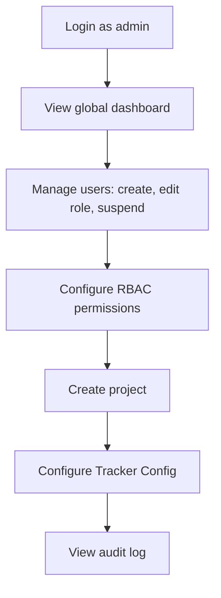
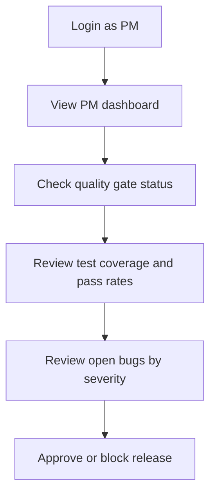
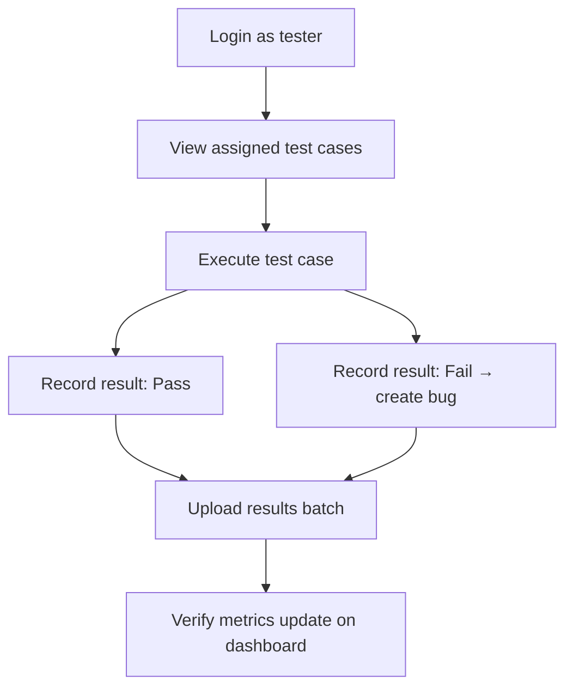
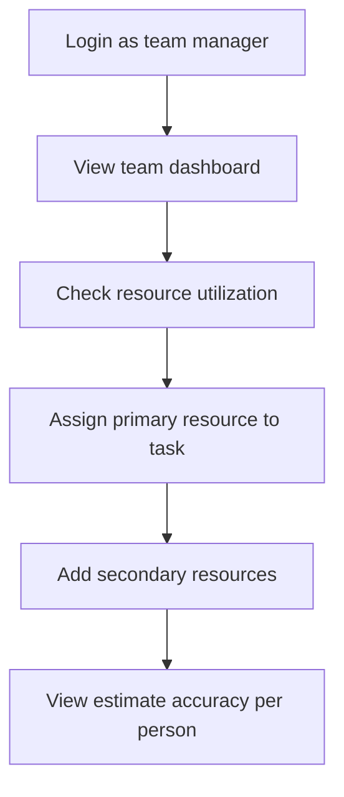
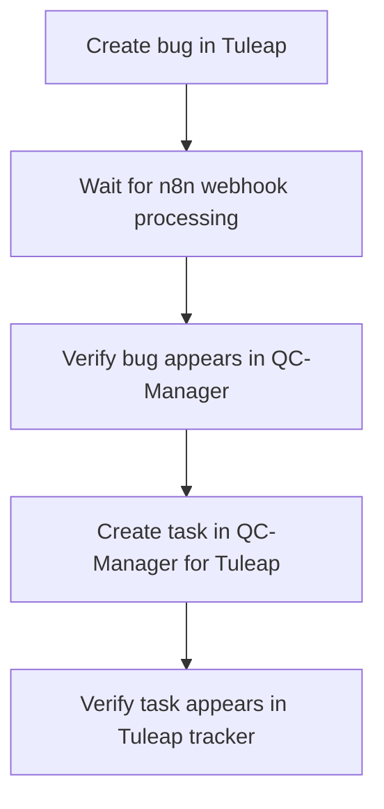

# E2E Scenarios

Key end-to-end test scenarios covering critical user journeys.

## Scenario 1: Admin Full Access

## Scenario 2: PM Release Readiness

## Scenario 3: Tester Test Execution

## Scenario 4: Team Manager Resource Management

## Scenario 5: Viewer Read-Only Access

| Step | Action | Expected |
|------|--------|----------|
| 1 | Login as viewer | Redirect to dashboard |
| 2 | Navigate to /projects | See project list |
| 3 | Click on a project | View project details |
| 4 | Attempt to create project | Button hidden or disabled |
| 5 | Attempt to edit task | Form is read-only |

## Scenario 6: Tuleap Sync

## Scenario 7: Authentication Flow

| Step | Action | Expected |
|------|--------|----------|
| 1 | Navigate to app without session | Redirect to login |
| 2 | Enter invalid credentials | Error message shown |
| 3 | Enter valid credentials | Redirect to dashboard |
| 4 | Wait for session expiry | Redirect to login on next action |
| 5 | Refresh token | Session extended |

## Scenario 8: Landing Page

| Step | Action | Expected |
|------|--------|----------|
| 1 | Visit / without login | See public landing page |
| 2 | View changelog section | Recent releases shown |
| 3 | View roadmap section | Upcoming items shown |
| 4 | Login as admin | Access /admin/landing-config |
| 5 | Edit landing features | Changes reflect on public page |

> [!NOTE]
> E2E test automation uses Playwright. See `apps/web/` for Playwright configuration.
