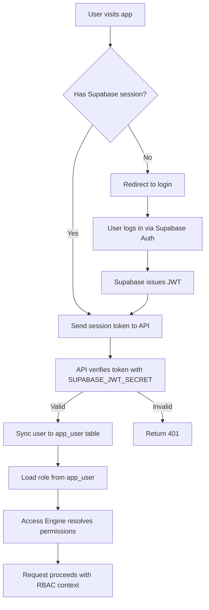

# Authentication

## Auth Flow

## Dual Auth Mode

| Mode | Active When | Token | Verification |
|------|-------------|-------|-------------|
| Supabase Auth | Supabase session exists | Supabase JWT | `SUPABASE_JWT_SECRET` |
| Legacy JWT | No Supabase session | Legacy JWT | `JWT_SECRET` |

> [!NOTE]
> Legacy JWT is retained as a fallback during Supabase migration.

## User Sync

On every authenticated request:
1. API extracts user from token
2. UPSERTs into `app_user` table (by `supabase_uid` or email)
3. New users get default role (configurable)
4. User status checked (`ACTIVE`, `PREPARATION`, `SUSPENDED`, `ARCHIVED`)

## Session Management

- Sessions managed by Supabase Auth (browser-side)
- API validates token on every request
- No server-side session store
- Token refresh handled by Supabase client SDK

## Public Endpoints

The following endpoints do not require authentication:

| Endpoint | Purpose |
|----------|---------|
| `GET /health` | Health check |
| `GET /api/public/landing-page` | Public landing content |
| `POST /api/tuleap-webhook/*` | Tuleap inbound (service-to-service, validated by payload schema) |
| `POST /api/webhooks/landing-content/*` | AI/n8n content (validated by `x-qc-agent-secret` header) |

## Security Considerations

- `SUPABASE_SERVICE_ROLE_KEY` is server-only; never exposed to browser
- `SUPABASE_ANON_KEY` is safe for browser; limited permissions
- `JWT_SECRET` and `SUPABASE_JWT_SECRET` must differ
- `QC_AGENT_WEBHOOK_SECRET` verified via `x-qc-agent-secret` header; server-only
