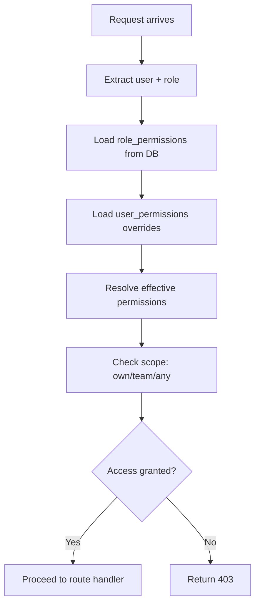

# Authorization / RBAC

## Overview

QC-Manager uses a two-tier authorization model:

1. **Legacy Catalog Mode** (`RBAC_UNIFIED=off`, default): Permissions defined in `apps/shared/rbac/catalog.ts`
2. **Access Engine Mode** (`RBAC_UNIFIED=on`): Runtime permission resolution from DB matrix (ADR 0010, 0011)

## Roles

### Active Roles (6)

| Role | Scope | Key Capabilities |
|------|-------|------------------|
| `admin` | System-wide | Full access, user management, RBAC config, landing page admin |
| `pm` | Project | Project oversight, quality gates, release approvals, dashboards |
| `team_manager` | Team | Resource management, IDPs, team dashboards, workload views |
| `tester` | Member | Test execution, bug reporting, personal tasks, test case authoring |
| `viewer` | Team | Read-only access to dashboards, reports, artifacts |
| `contributor` | Team | Limited data entry within project/team scope |

### Legacy Role Canonicalization

| Legacy Role | Maps To | Status |
|-------------|---------|--------|
| `manager` | `team_manager` | Deprecated |
| `user` | `tester` | Deprecated |
| `member` | `tester` | Deprecated |

Permission checks canonicalize legacy roles automatically. Use canonical names in all new code.

## Permission Keys

Permissions use `qc.*` namespace. Examples:

| Key | Meaning |
|-----|---------|
| `qc.projects.read` | Can view projects |
| `qc.projects.create` | Can create projects |
| `qc.projects.update` | Can edit projects |
| `qc.projects.delete` | Can soft-delete projects |
| `qc.tasks.read` | Can view tasks |
| `qc.admin.landing_page.manage` | Can manage landing page content |

## Access Engine (ADR 0010/0011)

When `RBAC_UNIFIED=on`:

### Key Design Points

- **Matrix is runtime source of truth**: DB tables `role_permissions` + `role_scopes`
- **Catalog is vocabulary only**: `apps/shared/rbac/catalog.ts` defines keys, not grants
- **Per-user overrides**: `user_permissions` table for exceptions
- **Hot-reloadable**: Read per request; flip `RBAC_UNIFIED` with process restart
- **Terminal status floor**: `SUSPENDED`/`ARCHIVED` users denied regardless of permissions
- **Last-keyholder invariant**: At least one admin user with full permissions always exists

### Scope Model

| Scope | Meaning |
|-------|---------|
| `own` | User can act on their own artifacts |
| `team` | User can act on artifacts in their teams |
| `any` | User can act on any artifact |

## Route-Level Enforcement

### API

- `authMiddleware.js` extracts user, role, status
- Access engine middleware resolves permissions
- Route handlers check specific permission keys

### Frontend

- `RouteGuard.tsx` wraps protected pages
- `AuthProvider.tsx` provides permission context
- UI elements conditionally rendered based on permissions
