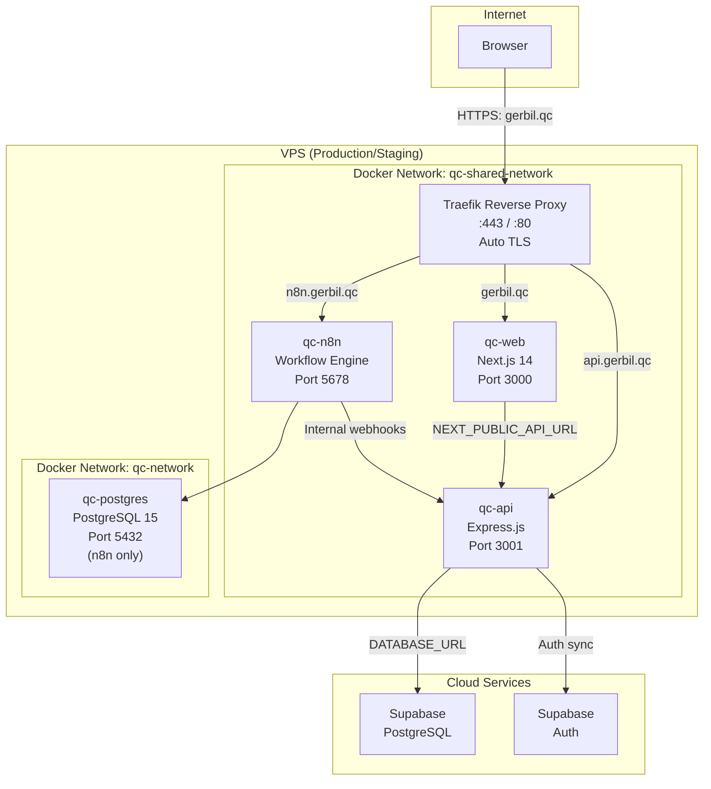

# Architecture Overview

## High-Level Topology



## Component Summary

| Component | Technology | Role |
|-----------|------------|------|
| **qc-web** | Next.js 14, React 18, TypeScript, Tailwind CSS | Frontend SPA with App Router |
| **qc-api** | Node.js 18, Express 4, Zod, JWT | REST API, migrations, business logic |
| **qc-n8n** | n8n 1.29.0 | Workflow automation, report generation |
| **qc-postgres** | PostgreSQL 15 (Docker) | n8n internal database only |
| **Supabase** | Cloud PostgreSQL | Production application database |
| **Traefik** | Traefik v2 | Reverse proxy, TLS termination |

## Repository Layout

```text
QC-Manager/
├── apps/
│   ├── api/                  # Express REST API
│   │   ├── src/
│   │   │   ├── config/       # DB connection (db.js), env
│   │   │   ├── routes/       # Route modules (auth, projects, tasks, etc.)
│   │   │   ├── schemas/      # Zod validation schemas
│   │   │   ├── middleware/   # Auth, error handling, audit
│   │   │   ├── services/     # Access engine, Tuleap persisters/emitters
│   │   │   └── utils/        # n8n client, helpers
│   │   └── tests/            # Jest/Supertest API tests
│   ├── web/                  # Next.js 14 frontend
│   │   ├── app/              # App Router pages (18 routes)
│   │   ├── src/
│   │   │   ├── components/   # Reusable React components
│   │   │   ├── lib/          # API client, utils
│   │   │   ├── types/        # TypeScript types
│   │   │   └── config/       # Route guards, feature flags
│   │   └── public/
│   └── shared/               # Shared RBAC catalog and utilities
│       └── rbac/
│           └── catalog.ts    # Role/permission definitions
├── database/
│   └── migrations/           # Reference SQL migrations
├── n8n/                      # n8n workflow JSON definitions
├── docs/                     # Documentation (this tree)
├── specs/                    # Feature specifications
├── docker-compose.yml        # Local dev Docker stack
├── docker-compose.prod.yml   # Production Docker stack
├── docker-compose.staging.yml
└── .github/workflows/        # CI/CD (deploy.yml)
```

## Key Design Decisions

| Decision | Reference | Summary |
|----------|-----------|---------|
| Unified Tuleap payload | ADR 0001 | Single JSON envelope for inbound/outbound artifact sync |
| Shared persister/emitter services | ADR 0002, 0004 | Thin route shims over shared business logic |
| QC UUIDs as canonical link IDs | ADR 0006 | Inter-artifact links use QC UUIDs; Tuleap IDs at boundary only |
| Zod validation in persisters | ADR 0007 | Validation inside services, not middleware |
| Task assignment junction | ADR 0009 | `task_resource_assignment` for primary+secondary resources |
| RBAC matrix as runtime source | ADR 0010 | DB-stored permission matrix; catalog as vocabulary only |
| Migration-on-startup | db.js `runMigrations()` | Idempotent DDL runs on every API startup |

## External Dependencies

| Dependency | Required? | Purpose |
|------------|-----------|---------|
| Supabase PostgreSQL | **Yes** (production) | Application database |
| Supabase Auth | **Yes** (production) | User authentication |
| n8n | Optional | Workflow automation, reports |
| Tuleap | Optional | Artifact sync |
| Docker Hub | Production | Image registry for CI/CD |
| Traefik | Production | Reverse proxy with TLS |
