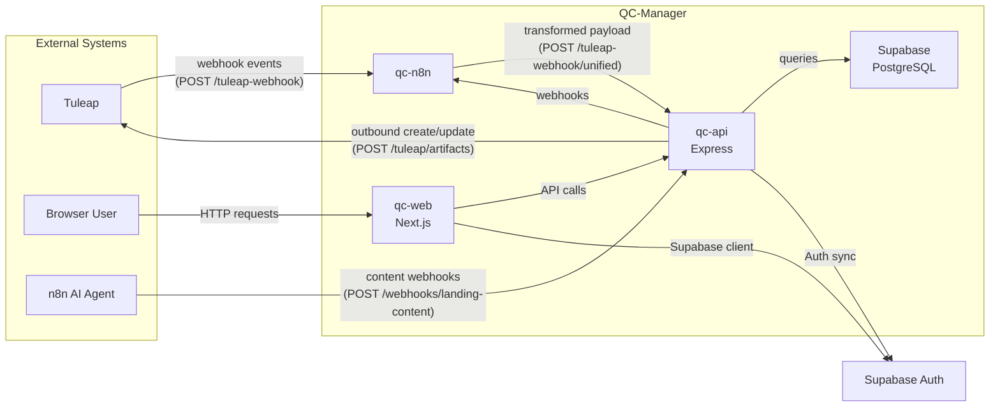

# Data Flow

## High-Level Data Flow



## Key Data Flows

### 1. Tuleap Inbound Sync

```
Tuleap artifact change
  → Tuleap webhook fires
  → n8n receives raw webhook
  → n8n transforms to Unified Payload
  → POST /api/tuleap-webhook/unified
  → API Persister processes (validate → resolve tracker config → upsert/delete/reject/archive)
  → QC database updated
```

### 2. Tuleap Outbound Creation

```
QC user creates artifact in web UI
  → POST /api/tuleap/artifacts/{type}
  → API Emitter builds Tuleap API payload
  → Calls Tuleap REST API with access key
  → Receives Tuleap artifact ID
  → Stores tuleap_artifact_id on QC row
  → Links resolved using QC UUIDs → Tuleap integer IDs
```

### 3. User Authentication

```
User logs in via Supabase Auth (web)
  → Supabase session created
  → API receives session token in Authorization header
  → API verifies token with Supabase JWT secret
  → API syncs user to app_user table if new
  → API loads role from app_user or defaults
  → Access Engine resolves permissions from DB matrix
```

### 4. Test Result Upload

```
Tester uploads XLSX/CSV test results
  → POST /api/test-results/upload
  → API parses spreadsheet
  → API matches test case IDs
  → API creates test_execution records
  → Quality metrics views recalculate automatically
  → Dashboards reflect updated pass rates
```

### 5. Report Generation (via n8n)

```
Scheduled trigger or manual API call
  → API calls n8n webhook
  → n8n workflow executes queries against API or DB
  → n8n formats report
  → n8n delivers via email or stores for download
```

## Data Consistency

| Mechanism | Applied To |
|-----------|------------|
| Soft deletes (`deleted_at`) | Projects, tasks, bugs, test artifacts |
| Audit logging (before/after) | All mutating operations via middleware |
| Idempotent migrations | API startup `runMigrations()` |
| UPSERT via `tuleap_artifact_id` | Tuleap inbound sync |
| QC UUID canonical links | Inter-artifact references (ADR 0006) |
